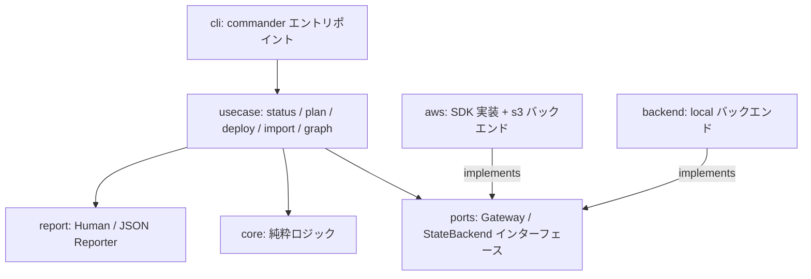

# cfnsync 設計書

対応する要件: [requirements.md](./requirements.md)

## 1. 設計方針

- **薄いラッパーに徹する**: CloudFormation の変更セット・スタック操作をそのまま使い、独自のプロビジョニング概念を持ち込まない(背景・スコープ外の遵守)。
- **純粋コア + アダプタ(ポート&アダプタ)**: 変更検知・依存解析・順序解決・計画立案は AWS 非依存の純粋ロジックとして実装し、AWS API はインターフェース(ポート)越しに呼び出す。TDD の単体テストは純粋コアに集中させる(NFR-2)。
- **fail-closed**: 変更系操作は、接続先検証・ステート整合・依存情報の完全性が確認できない限り実行しない(FR-6, FR-7)。
- **(テンプレート × リージョン)を管理単位とする**: すべての検知・計画・実行・記録はこの単位(以下「スタックキー」)で行う(FR-13)。

## 2. 技術選定(未確定事項の決定)

| 事項 | 決定 | 理由 |
|---|---|---|
| 実装言語・ランタイム | TypeScript / Node.js 20+ | GitHub Actions の JS アクション(node20 ランタイム)としてコンテナ不要でそのまま動かせる。CLI とアクションでコードを共有できる。AWS SDK v3 と `aws-sdk-client-mock` により TDD との相性が良い |
| 配布 | npm パッケージ(`npx cfnsync`)。将来 GitHub Action としてパッケージング | CI からの利用が最も簡単 |
| 開発時パッケージマネージャ | pnpm | 高速かつ厳密な依存管理のため。配布形式は npm パッケージのまま |
| 設定ファイル | `cfnsync.yaml`(テンプレートディレクトリ直下、YAML) | FR-11。スキーマ検証は zod で行う |
| ステート管理 | Terraform 方式のバックエンド切替: `local`(既定、ローカル JSON)/ `s3` | FR-1。CI・チーム利用は `s3` を必須とする。git 管理はマージ・push 競合や複数ランナー間の整合の運用負荷が大きいため不採用 |
| ステートの排他制御 | S3 条件付き書き込み(`If-Match` / `If-None-Match`)による CAS + ロックオブジェクト | DynamoDB 等の追加リソース不要で「必要最低限」を維持しつつ、並行実行を fail-closed にできる(§4.5) |
| SAM テンプレート | 特別扱いしない。`CAPABILITY_AUTO_EXPAND` の指定のみで対応 | スコープ外(テンプレート変換をしない)の方針通り |

主要ライブラリ:

| 用途 | ライブラリ |
|---|---|
| AWS API | `@aws-sdk/client-cloudformation`, `@aws-sdk/client-sts`, `@aws-sdk/client-s3` |
| CLI | `commander` |
| YAML(CFN 短縮タグ対応) | `yaml`(customTags で `!ImportValue` 等を登録) |
| スキーマ検証 | `zod` |
| テスト | `vitest`, `aws-sdk-client-mock` |

## 3. アーキテクチャ



図は存在する依存のみを描く。`core` はどこにも依存しない(アダプタ `aws` / `backend` への依存禁止を含む。下記の依存方向を参照)。

| モジュール | 責務 | 主な要件 |
|---|---|---|
| `core/config` | `cfnsync.yaml` の読込・zod 検証・スタック名導出 | FR-11, FR-13 |
| `core/state` | ステートのスキーマ検証・世代管理(compare-and-swap 判定)。読み書きは `StateBackend`(ports)経由 | FR-1 |
| `core/template` | テンプレートのパース(CFN 短縮タグ)、Export / ImportValue / NoEcho の抽出 | FR-8, NFR-4 |
| `core/detect` | スタックキー単位の変更分類(added / modified / deleted / unchanged) | FR-1, FR-13 |
| `core/graph` | 依存グラフ構築・トポロジカルソート・循環検出・新旧グラフの統合 | FR-8, FR-9, FR-6 |
| `core/plan` | 実行計画(リージョン別・依存順の操作列)の立案 | FR-5, FR-9, FR-13 |
| `usecase/*` | 各コマンドのオーケストレーション | FR-12 |
| `usecase/guard` | 接続先検証(fail-closed) | FR-7 |
| `usecase/executor` | 変更セットのライフサイクル管理・イベントストリーム・待機 | FR-2, FR-4, FR-6 |
| `usecase/importer` | 既存スタックのインポート | FR-10 |
| `ports` | `CloudFormationGateway` / `StsGateway` / `StateBackend` インターフェース定義 | NFR-2, FR-1 |
| `aws` | SDK v3 によるゲートウェイ実装(リトライ・スロットリング対応)と `s3` ステートバックエンド | NFR-3, FR-1 |
| `backend` | `StateBackend` の `local` 実装(原子的ファイル置換・`.bak` 保持) | FR-1 |
| `report` | 人間可読テキスト / JSON 出力、NoEcho マスク | FR-3, NFR-4 |

依存方向: `cli → usecase → core / ports / report`。`aws` / `backend` は `ports` を実装する。`core` はどこにも依存しない。

## 4. データ設計

### 4.1 スタックキー

管理単位の識別子。`<テンプレート相対パス>@<リージョン>`(例: `network.yaml@ap-northeast-1`)。

### 4.2 設定ファイル `cfnsync.yaml`

```yaml
version: 1
allowedAccounts: ["123456789012"]        # FR-7 必須(変更系操作の前提)
allowedRegions: [ap-northeast-1, us-east-1]
defaultRegion: ap-northeast-1
stackNamePrefix: legacy-app-             # 任意。スタック名導出規約に使用

state:                                   # ステートバックエンド(FR-1)。省略時は local
  backend: s3
  s3:
    bucket: my-cfnsync-state
    key: prod/cfnsync.state.json
    region: ap-northeast-1

stacks:
  network.yaml:
    stackName: prod-network              # 省略時: prefix + ファイル名(拡張子除去)
    regions: [ap-northeast-1, us-east-1] # 省略時: [defaultRegion]
    parameters:
      VpcCidr: 10.0.0.0/16
      DbPassword: __REQUIRED__           # NoEcho プレースホルダ(FR-10)。残存したまま deploy は拒否
    tags:
      Project: legacy-app
    capabilities: [CAPABILITY_NAMED_IAM]
    dependsOn: []                        # 自動解析で表現できない依存の明示宣言(FR-8)
    regionOverrides:                     # FR-13 リージョン別上書き
      us-east-1:
        parameters:
          VpcCidr: 10.1.0.0/16
```

- パラメータ・タグの実効値 = 共通値に `regionOverrides.<region>` を浅くマージしたもの。
- インポート(FR-10)はこのファイルの `stacks` 配下を機械的に更新する。コメント・キー順を保持するため YAML の AST 編集(`yaml` パッケージの Document API)で書き戻す。
- `stacks` のテンプレートパスは相対パスのみとし、絶対パス・NUL・正規化後に `..` から始まるパスを config 検証で拒否する。読み取りおよび import の書き込みでは、対象(未作成なら既存の最長親)の realpath が設定ディレクトリ配下であることを再検証し、シンボリックリンク経由の脱出も fail-closed に拒否する。

### 4.3 ステートファイル `cfnsync.state.json`

```json
{
  "schemaVersion": 1,
  "accountId": "123456789012",
  "generation": 42,
  "stacks": {
    "network.yaml@ap-northeast-1": {
      "stackName": "prod-network",
      "region": "ap-northeast-1",
      "templateHash": "sha256:abc...",
      "inputsHash": "sha256:def...",
      "exports": ["prod-network-VpcId"],
      "imports": [],
      "dependsOn": [],
      "lastAction": "UPDATE",
      "lastSuccessAt": "2026-07-19T00:00:00Z"
    }
  }
}
```

- `accountId`: このステートが表す AWS アカウント。初回の変更系実行時に接続先から記録し、以後 STS の解決結果と不一致なら実行を拒否する(FR-1)。複数アカウントを扱う場合は設定+ステートの組をディレクトリごと分離する。
- `templateHash`: デプロイ成功時点のテンプレートファイル内容の SHA-256。
- `inputsHash`: テンプレート内容 + スタック名 + 実効パラメータ + タグ + Capabilities + 明示依存(`dependsOn`)の複合ハッシュ。**設定ファイルのみの変更もデプロイ対象として検知する**ため(FR-1 の変更検知を「デプロイへの入力全体」に適用)。
- `exports` / `imports`: 前回成功時点の依存辺。テンプレートファイル削除後の削除順序決定に使用(FR-6, FR-8)。
- `dependsOn`: 前回成功時点の**明示依存**(設定の `dependsOn` をスタックキーに解決したもの)。自動解析辺と同様に旧グラフの復元に含める。これがないと明示依存のみで結ばれたスタック群の削除順が復元できない(FR-6-4/FR-6-5 の fail-closed 対象)。
- `generation`: 保存のたびにインクリメント。読込時点の世代(`s3` では ETag)との比較により compare-and-swap を実現する(FR-1、§4.5)。

### 4.4 変更分類(core/detect)

| 条件 | 分類 |
|---|---|
| 設定に存在し、ステートに存在しない(新テンプレート or 新リージョン) | `added` |
| 双方に存在し、`inputsHash` が不一致 | `modified` |
| 双方に存在し、`inputsHash` が一致 | `unchanged` |
| ステートに存在し、設定に存在しない(ファイル削除 or リージョン除外) | `deleted` |

ハッシュはファイル内容に基づくため、タイムスタンプのみの変更は `unchanged` となる(FR-1)。

- **スタック名の変更**(設定から導出したスタック名とステートの記録が不一致)は「旧スタック名のスタックの削除 + 新スタック名での新規作成」として計画する(FR-1)。削除側は FR-6 の安全装置(`--allow-delete` 等)に従うため、既定では警告となり旧スタックは残る。
- `dependsOn` 等の依存情報のみの変更で CloudFormation 上の差分が生じない場合でも、ステートの依存辺(`exports` / `imports`)と `inputsHash` は最新化して保存する(削除順序の決定に使う旧グラフを陳腐化させないため)。

### 4.5 ステートバックエンドと排他制御

| | `local`(既定) | `s3` |
|---|---|---|
| 保存先 | `cfnsync.state.json`(設定ファイルと同階層) | `state.s3.bucket` / `key` で指定したオブジェクト |
| 想定用途 | 単一環境・個人利用 | CI・チーム利用(必須) |
| compare-and-swap | 保存直前に再読込して世代比較 | `PutObject` の `If-Match: <読込時 ETag>` による条件付き書き込み |
| ロック | なし(単一環境前提) | ロックオブジェクト `<key>.lock` を `If-None-Match: *` で作成。作成失敗 = 他実行が保持 → 即エラー |

- **原子的保存**(FR-1): `local` は同一ディレクトリの一時ファイルへの書き込み + fsync + rename で置換し、直前の内容を `.bak` として保持する。読込時に zod でスキーマ検証し、破損を検出した場合は変更系操作を拒否する(fail-closed)。復旧は `.bak` または S3 バージョニングから行う。
- **ロックの内容と解除**: ロックオブジェクトには実行 ID・開始時刻・実行者を記録し、取得時のレスポンスの ETag を保持する。解除は正常・異常・手動(force-unlock)のいずれも `DeleteObject` の `If-Match: <ETag>` による条件付き削除とし、現在の所有者が自分(または指定対象)である場合のみ成立させる。条件不成立(所有者交代)の場合は削除せず、その事実を報告する。プロセス強制終了等で残存したロックは `cfnsync force-unlock <実行ID>` で解除する(§5.6)。
- **fencing**: すべての副作用の直前 — 変更セットの作成・実行・削除、スタック削除、ステート保存(完了待機後・空変更セット時を含む)、import による設定・テンプレートファイルの書き込み — にロックオブジェクトを再読込し、実行 ID・ETag が自分のものであることを検証する。IF 所有権を失っていた場合(force-unlock 後に別実行が取得した等)、当該副作用を実行せず直ちに中断する(NFR-3)。特に deploy の完了待機は長時間に及ぶため、待機完了後・ステートの CAS 保存直前の再検証を必須とする。
- **fencing の限界と多層防御**: 上記の再検証は check-before-write であり、検証から副作用(CloudFormation 呼び出し・ファイル書き込み)までの間に force-unlock と新ロック取得が起こる競合窓は原理的に排除できない(CloudFormation はフェンシングトークンを検証できないため)。厳密な保証は次の多層防御に置く: ①ステート正本の一貫性は CAS(`If-Match`)が保証する — 競合した側の保存は必ず失敗し、正本は分岐しない。②同一スタックへの同時操作は、実行直前の `*_IN_PROGRESS` ガード(§7)と、CloudFormation 自体が進行中のスタックへの `ExecuteChangeSet` を拒否することで、どちらか一方が安全に失敗する。③force-unlock は旧実行の終了確認を前提とする操作と位置づける(§5.6)。fencing はこの上で競合窓を最小化する層である。
- `s3` バックエンドのバケットはバージョニング有効を推奨する(誤上書き・破損からの復旧手段)。

## 5. 主要フロー

すべての変更系フローは最初に **AccountGuard**(§8.1)を通過し、**ステートロック**(§4.5)を取得してから実行する。ロックは正常・異常を問わず終了時に解放する。リージョンは設定順に直列処理し、各リージョン内はトポロジカル順に直列処理する(FR-9, FR-13)。

### 5.1 `cfnsync status`

config 読込 → state 読込 → 変更分類を表形式 / JSON で出力。CloudFormation / STS は呼び出さない(NFR-5)。S3 state backend を選択した場合のステート読み取りは除く。終了コード 0。

### 5.2 `cfnsync plan`(dry-run)

1. config 検証 → AccountGuard(変更セット作成は変更系のため必須)→ ステートロック取得
2. state 読込 → 変更分類 → 依存グラフ構築(新旧統合)→ 実行計画立案
3. `added` / `modified` の各スタックキーに対し変更セットを作成 → `DescribeChangeSet` で差分取得 → **describe 後に変更セットを削除**(残骸を残さない。クラッシュ時の残骸は §7 の残存回収が拾う)
4. `deleted` は削除プレビューとして差分出力に含める(FR-6)
5. 差分を出力(リージョン明示・Replacement 警告・NoEcho マスク)
6. 終了コード: 差分あり 2 / なし 0 / エラー 1

### 5.3 `cfnsync deploy`

1. config 検証 → AccountGuard → ステートロック取得 → state 読込(世代 / ETag 記録)
2. 変更分類 → 依存グラフ → 実行計画
3. 各スタックキーについて順に:
   - スタック状態ガード(§7)→ 残存変更セット回収 → 変更セット作成
   - 空変更セット → 変更セット削除、ステート更新(unchanged 扱いで記録)、次へ
   - 差分出力 → `ExecuteChangeSet` → イベントをポーリングして逐次出力 → 完了待機
   - **成功のたびに fencing 検証(§4.5)の上でステートを更新・保存(CAS)**。失敗したスタックのステートは更新しない(FR-1)。これにより途中失敗後の再実行は成功済み分をスキップできる(NFR-3)
   - 失敗時: 依存する後続スタックを中止。独立スタックの扱いは `--on-failure stop|continue`(既定 `stop`)(FR-9)
4. `deleted` の処理は `--allow-delete` 指定時のみ、全作成・更新の後に逆順で実行(§8.3)
5. `--dry-run` は plan と同一動作(FR-5)

### 5.4 `cfnsync import`

1. STS で接続先アカウントを解決 → ステートロックを取得(§4.5)。import は AWS へは読み取り専用だが、ステート・設定ファイルを書き込むため変更系と同じ排他制御に従う
2. ロック配下でステートを再読込し、`accountId` と照合(FR-1)。ロック取得前に読んだステートは判断に使用しない。不一致なら一切の書き込みを行わず終了。未記録(初回)の場合は、アカウント ID を含む初回保存を同一ロック区間内の CAS 保存として行う
3. config の `stacks` エントリ(最小: テンプレートパスとスタック名 or 導出規約)を対象に、リージョンごとに `DescribeStacks` + `GetTemplate` を実行(AWS へは読み取りのみ)
4. パラメータ実値・タグ・Capabilities を `cfnsync.yaml` に書き戻す。NoEcho パラメータは `__REQUIRED__` を記録(FR-10)
5. デプロイ済みテンプレートとローカルファイルを比較:
   - 一致 → ステートに `templateHash` / `inputsHash` / 依存辺を記録
   - 不一致 → 既定はエラー。`--reconcile remote`(デプロイ済み内容でローカルを上書き)or `--reconcile local`(ローカル維持。ステートにはデプロイ済み側のハッシュを記録し、次回 plan で差分が顕在化)
   - ローカルファイルなし → `--write-template` でデプロイ済みテンプレートを書き出し
6. 対応するスタックが存在しないテンプレートはそのまま(次回 `added` 扱い)

### 5.5 `cfnsync graph`

テンプレート解析のみで依存グラフをリージョンごとに構築し、テキストツリー / JSON で出力。循環はエラー(FR-8)。

### 5.6 `cfnsync force-unlock`

異常終了で残存したステートロック(`s3` バックエンド)を手動で解放する。ロックに記録された実行 ID の指定を必須とし、現在のロックの実行 ID が指定値と一致する場合のみ `If-Match` 条件付き削除で解放する(読み取りから削除までの間の所有者交代による誤解放を防ぐ。FR-1)。

保持していた実行(CI ジョブ・プロセス)が終了していることを利用者が確認した場合にのみ使用してよい操作であり、コマンドはロックの内容(実行 ID・開始時刻・実行者)と警告を表示する。解除後の最初の実行では、進行中だった可能性のある操作は `*_IN_PROGRESS` ガード(§7)で検出され、完了済みの操作は実スタックとの突合による復旧分岐(§7)および空変更セットによる再同期で吸収される(復旧手順は §11)。

## 6. 依存関係解析(core/template + core/graph)

- YAML パースは `yaml` パッケージに CFN 短縮タグ(`!Ref`, `!Sub`, `!ImportValue`, `!GetAtt` 等)を customTags として登録して行う。JSON テンプレートはそのままパース。
- **依存辺の抽出**: テンプレート中の `Fn::ImportValue`(短縮形含む)の値が静的文字列の場合、その Export 名を import として記録。`Outputs.*.Export.Name` が静的文字列、または `${AWS::StackName}` 等の解決可能な擬似パラメータのみを含む `Fn::Sub` の場合、解決して export として記録。
- **解決不能ケース**(動的な Sub 合成等)は警告を出し、必要なら `dependsOn` の明示宣言でカバーする(FR-8)。明示宣言は自動解析結果とマージされる。
- グラフはリージョンごとに独立構築(FR-13)。export 名 → 提供スタックキーの索引を作り、import 参照から辺を張る。
- 削除順序の決定には、現在のテンプレート群から構築したグラフに、ステートの `exports` / `imports` から復元した旧グラフを統合したものを用いる(FR-6)。
- トポロジカルソートは Kahn 法。循環検出時は循環に含まれるスタックキーを列挙してエラー(FR-8)。

## 7. 変更セットのライフサイクル(usecase/executor)

- **命名規則**: `cfnsync-<ステートID>-<実行ID>-<UTC タイムスタンプ>`。ステート ID はバックエンド識別子(`local`: ステートファイルの絶対パス、`s3`: バケット + キー)の短縮ハッシュ。プレフィックス `cfnsync-` でツール由来を、ステート ID で所有ステートを識別する(FR-2)。
- **残存回収**: 変更セット作成前に `ListChangeSets` で未実行の変更セットを列挙し、名前から所有権を判定して処理する(FR-2)。回収(削除)するのは**自ステート ID に一致する** `cfnsync-` 変更セットのみ。同一ステートを共有する実行はロック(§4.5)で排他されるため、これらは過去の異常終了の残骸と確定できる。IF 別のステート ID を持つ、または命名規則から所有権を判定できない `cfnsync-` 変更セットを検出した場合、同一スタックが複数のステート設定から管理されている構成ミス(並行実行の可能性)の証拠として、削除せず中断する(NFR-3)。`cfnsync-` プレフィックス以外の変更セット(人手・他ツール由来)が存在する場合も削除せず fail-closed に停止する — 後続の `ExecuteChangeSet` が同一スタックの他の変更セットを暗黙に削除してしまうため、解決(当該変更セットの実行または削除)後の再実行を案内する。
- **実行直前の再検査**: `ExecuteChangeSet` の直前に対象スタックの未実行変更セット一覧を再取得し、自変更セット以外が存在する場合は実行せず fail-closed に停止する(FR-2)。再検査から実行までの競合窓は原理的に排除できない(CloudFormation に条件付き実行が存在しない)ため、§4.5 の多層防御と同様に残余リスクとして仕様に明記し、cfnsync 管理対象スタックに手動・他ツールの変更セットを作成しない運用規約を README に記載する(§11)。
- **空変更セット**: `DescribeChangeSet` の Status が `FAILED`、StatusReason が AWS の既知の定型文(`The submitted information didn't contain changes. Submit different information to create a change set.` / `No updates are to be performed.`)に先頭一致、かつ全ページ結合済み `changes.length === 0` のすべてを満たす場合だけ、エラーではなく変更なしとして扱い、変更セットを削除する(FR-2)。Macro / Transform 等の失敗理由中に同じ語句が現れるだけのケースや changes 非空のケースは必ず失敗とする。
- **スタック状態ガード**(作成前に `DescribeStacks` で確認):
  - `*_IN_PROGRESS` → 並行操作ありとしてエラー(FR-2)
  - `ROLLBACK_COMPLETE` → エラー + 「スタック削除後に再作成が必要」の案内(FR-2)
  - `REVIEW_IN_PROGRESS`(変更セット未実行のままの空スタック)→ **スタック自体の `DeleteStack` は行わない**(検証と削除の間の競合窓で他主体の変更セットを巻き込む余地を構造的に排除する)。自ステート ID の変更セットのみ個別に破棄し、既存の `REVIEW_IN_PROGRESS` スタック上に `CREATE` 型変更セットを再作成して続行する(CloudFormation は `REVIEW_IN_PROGRESS` スタックへの `CREATE` 型作成を許可している)。IF 他主体の変更セット(非 `cfnsync-` または別ステート ID)が存在する場合、変更セットを作成せず命名衝突・並行操作の可能性として fail-closed に停止し、手動対応を案内する(FR-2)
  - スタックなし → `CREATE` 型 / あり → `UPDATE` 型
- **実スタックとの突合による復旧分岐**(FR-1。AWS 操作成功後・ステート保存前の中断からの自動収束):
  - `added` 分類だがスタックが既に存在する場合(過去実行の CREATE 成功後にステート保存だけが失敗したケース、または命名衝突): 実スタックから検証可能な入力の**すべて**を希望する内容と比較する — `GetTemplate`(`Original` ステージ)で取得したテンプレートのパース後同値比較、`DescribeStacks` で取得した実効パラメータ・タグ・Capabilities の完全一致。一致条件には管理タグ(§8.4)による由来確認を含み、IF 管理タグが自ステート ID と一致しない(欠如を含む)場合、他がすべて一致しても再同期せずエラーとする(fail-closed。NoEcho 実値のように検証不能な入力があっても由来を確認できる)。すべて一致した場合のみデプロイ成功として fencing 検証の上でステートに記録(再同期)して次へ進む。実スタックから同値性を検証できない入力(`dependsOn`・NoEcho パラメータの実値)は一致条件に含めず、ローカルの希望値を `inputsHash` としてステートに記録し、除外した項目を出力に明示する。一つでも不一致がある場合は命名衝突または管理外スタックの可能性としてエラーとし、インポート(§5.4)を案内する
  - `deleted` 分類だがスタックが存在しない場合: 削除成功とみなし、ステートからエントリを除去して CAS 保存する

## 8. 安全装置

### 8.1 AccountGuard(FR-7)

1. `allowedAccounts` / `allowedRegions` が設定に存在しない → 変更系操作は即エラー(fail-closed)
2. STS `GetCallerIdentity` で接続先アカウント ID を解決。解決不能・不一致 → 変更セット作成前にエラー
3. ロック取得後に再読込したステートの `accountId` と照合し、不一致なら実行拒否。未記録(初回)の場合は解決したアカウント ID を初回の CAS 保存に含めて記録する(§4.3)。ロック取得前に読んだステートを照合の判断に使用しない
4. 実行計画中の全対象リージョンが `allowedRegions` に含まれることを検証(FR-13)
5. 解決した接続先(アカウント ID・リージョン)をログと JSON 出力の先頭に含める
6. status / graph は AWS を呼ばないため対象外。import は `allowedAccounts` の設定なしでも実行できるが、ステートを書き込むため FR-1 のアカウント照合とロック取得(§5.4)を必ず行い、接続先を出力する

### 8.2 NoEcho マスク(NFR-4)

テンプレートの `Parameters` で `NoEcho: true` のキーは、差分出力・ログ・JSON のすべてで値を `****` にマスクする。usecase は対象スタックの設定上の実効パラメータ値から共通 redactor を構成し、イベントの `ResourceStatusReason`、スタック/変更セットの `StatusReason`、AWS 例外メッセージ、最終 `errorMessage` を逐次通知・report 格納の前に通す。report は格納済みのイベント・エラー文字列にも同じ redactor を適用して多層防御とする。空文字および 4 文字未満の値は誤マスクを避けるため置換しない。設定ファイルに `__REQUIRED__` プレースホルダが残っている場合、当該スタックの deploy は検証エラーで拒否する。

### 8.3 削除(FR-6)

- `deleted` 分類は plan / deploy の差分出力に常に含めるが、実削除は `--allow-delete` 指定時のみ。
- 削除前チェック: 削除保護有効 → エラー(自動解除しない)。ステートに依存辺が存在しない・復元できない → 削除拒否 + 手動対応の案内。
- 統合グラフの逆トポロジカル順で削除。削除成功のたびにステートからエントリを除去し保存(CAS)。

### 8.4 管理タグ(provenance)

ツールは作成・更新するすべてのスタックに管理タグ `cfnsync:state-id=<ステートID>` を自動付与する(変更セットのタグへ常時マージ。FR-2)。用途:

- CREATE 復旧(§7)における由来確認。NoEcho パラメータの実値のように実スタックから検証できない入力が存在しても、管理タグの一致により「自ステートの実行が作成したスタック」であることを確認できる。
- 管理外スタックとの命名衝突検出の強化(管理タグの欠如・別ステート ID は即エラー)。
- インポートで取り込んだ既存スタックには、次回の更新デプロイ時に付与される。

## 9. エラー処理と終了コード

| 終了コード | 意味 |
|---|---|
| 0 | 成功(変更なしを含む) |
| 1 | エラー(検証・ガード・AWS 操作の失敗) |
| 2 | 差分あり(plan / dry-run 時のみ) |

- エラーは型で分類する: `ConfigError` / `GuardError` / `StateConflictError` / `DependencyCycleError` / `StackStateError` / `AwsError`。すべてスタックキー・リージョン・原因を含むメッセージを持つ。
- AWS API のスロットリングは SDK v3 の adaptive retry mode + 指数バックオフで吸収(NFR-3)。
- デプロイ失敗時は失敗リソースの `ResourceStatusReason` をスタックイベントから抽出して表示し、ロールバックの発生と結果を報告する(FR-4)。

## 10. テスト戦略(TDD)

- requirements.md の各受け入れ基準(WHEN / IF 文)を 1 対 1 でテストケース化する。対応表は tasks.md で管理する。
- **core/**: AWS 非依存の純粋関数として実装し、vitest の単体テストでカバーする(fixtures にテンプレート・設定・ステートのサンプルを置く)。例:
  - `detect`: 「同一内容でタイムスタンプのみ異なる → unchanged」「リージョン追加 → added」
  - `graph`: 「Export/Import から辺を構築」「循環 → 循環要素を列挙してエラー」「旧グラフ統合で削除順を決定」
  - `state`: 「保存ペイロード生成で世代がインクリメントされる」「読込時世代からの変更を StateConflictError と判定する」「破損ステートの読込 → fail-closed 判定」(ロック・原子的置換・ETag などバックエンド固有の経路は `aws/`・`backend/` で、fencing 中断シナリオは `usecase/` でテストする)
- **障害注入シナリオ**: AWS 操作成功直後・ステート保存前の中断を CREATE / UPDATE / DELETE それぞれで注入し、再実行が自動収束すること(FR-1、§7 の復旧分岐)を検証する。CREATE 復旧では「タグのみ異なる同名管理外スタック」「Capabilities のみ異なる同名管理外スタック」「NoEcho 実値のみ異なる(=管理タグを持たない)同名管理外スタック」を含め、一致条件を満たさないスタックが再同期されずインポート案内付きで停止することも検証する。また `REVIEW_IN_PROGRESS` スタックに対して `DeleteStack` が一切呼ばれないこと(自変更セットの個別削除のみが行われること)、他主体の変更セットが存在する場合・所有権確認直後に並行追加された場合のいずれも、実行直前の再検査(§7)により `ExecuteChangeSet` が呼ばれず他主体の変更セットが暗黙削除されないことも検証する。
- **ports 実装(aws/・backend/)**: `aws-sdk-client-mock` で SDK レスポンスをスタブし、変更セットの状態遷移(空変更セット判定・所有権判定つき残存回収・IN_PROGRESS ガード)を検証する。S3 バックエンドの条件付き書き込み・ロック競合(`PreconditionFailed`)・`If-Match` 条件付きロック解除(所有者交代時は削除しない)も同様に検証する。`backend/` の local バックエンドは、原子的置換(保存途中の中断で元ファイルが無傷・`.bak` 保持)と保存直前の世代比較 CAS をテンポラリディレクトリで検証する。
- **usecase/**: ゲートウェイをインメモリのフェイクに差し替えたシナリオテスト(「plan → deploy → 再実行で変更なし」の冪等性、途中失敗 → 再実行の継続性、完了待機中に force-unlock された場合のステート保存直前 fencing 中断、fencing 検証と副作用の間で所有権交代が起きた競合窓シナリオでも CAS 失敗と `*_IN_PROGRESS` ガードにより正本が分岐しないこと)。
- 実 AWS を使う E2E は初期リリースのスコープ外(手動検証手順を README に記載)。

ディレクトリ構成:

```
src/
  cli/            # commander 定義のみ(薄く保つ)
  usecase/        # guard, executor, importer, 各コマンド
  core/           # config, state, template, detect, graph, plan(純粋)
  ports/          # Gateway / StateBackend インターフェース
  aws/            # SDK 実装(s3 ステートバックエンド含む)
  backend/        # StateBackend の local 実装
  report/         # Reporter
test/
  core/ usecase/ aws/ backend/ report/ cli/
  fixtures/       # テンプレート・設定・ステートのサンプル
docs/spec/        # requirements.md / design.md / tasks.md
```

## 11. リファレンス GitHub Actions ワークフロー(FR-1, NFR-3)

```yaml
name: cfnsync deploy
on:
  push:
    branches: [main]
concurrency:
  group: cfnsync-prod        # 推奨: 並行トリガーをロック競合エラーではなく待機にする(NFR-3)
  cancel-in-progress: false
permissions:
  id-token: write
  contents: read
jobs:
  deploy:
    runs-on: ubuntu-latest
    steps:
      - uses: actions/checkout@v4
      - uses: aws-actions/configure-aws-credentials@v4
        with:
          role-to-assume: arn:aws:iam::123456789012:role/cfnsync-deploy
          aws-region: ap-northeast-1
      - run: npx cfnsync deploy
        working-directory: templates
```

- ステートは `s3` バックエンド(§4.5)に保存されるため、ワークフローは git への書き戻しを行わない。排他はツールのステートロックが保証し、`concurrency` グループは待ち時間の体験改善のための推奨構成に留まる(設定漏れでも安全性は損なわれない)。
- **運用規約**(README に記載): cfnsync 管理対象のスタックに手動・他ツールで変更セットを作成しない。存在する場合、cfnsync は暗黙削除を避けるため fail-closed で停止する(§7)。
- **復旧手順**(README に記載): デプロイ途中失敗 → そのまま再実行(成功済みスタックは変更なしとしてスキップ。CREATE / DELETE が成功しステート保存のみ失敗した場合も、実スタックとの突合(§7)で自動収束する)。ロック残存 → 旧実行(CI ジョブ)の終了を確認した上で `cfnsync force-unlock <実行ID>` を実行し、再実行。ステート破損 → S3 バージョニングから直前版を復元して再実行。

## 12. 要件トレーサビリティ

| 要件 | 実現箇所 |
|---|---|
| FR-1 変更検知・ステート | core/detect, core/state, §4.3–4.5 |
| FR-2 変更セット作成 | usecase/executor, §7 |
| FR-3 差分表示 | report, §5.2 |
| FR-4 デプロイ実行 | usecase/executor, §5.3, §9 |
| FR-5 一括実行 | usecase(deploy = plan+apply), §5.3 |
| FR-6 削除 | §8.3, core/graph(旧グラフ統合) |
| FR-7 認証・誤接続防止 | usecase/guard, §8.1 |
| FR-8 依存マッピング | core/template, core/graph, §6 |
| FR-9 依存順デプロイ | core/plan, §5.3 |
| FR-10 インポート | usecase/importer, §5.4 |
| FR-11 設定ファイル | core/config, §4.2 |
| FR-12 CLI | cli, §5, §9 |
| FR-13 マルチリージョン | スタックキー設計(§4.1), §5, §6 |
| NFR-1〜6 | §2(技術選定), §9(リトライ), §10(テスト), §11(CI) |

## 13. 次工程

tasks.md にて、本設計のモジュール単位で TDD の実装タスク(受け入れ基準 → テストケース対応を含む)へ分解する。
