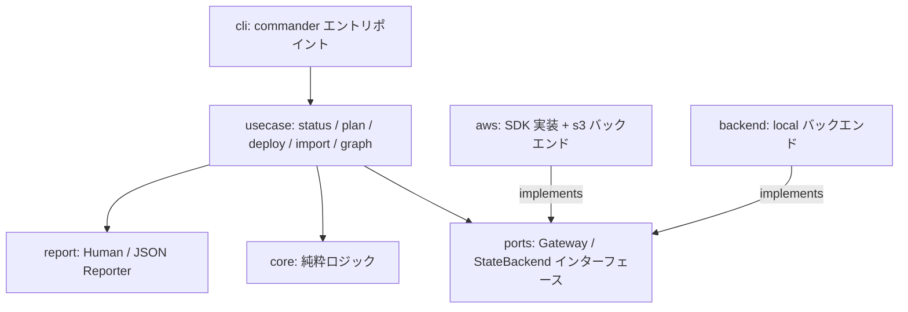

# cfnsync 設計書

対応する要件: [requirements.md](./requirements.md)

## 1. 設計方針

- **薄いラッパーに徹する**: CloudFormation の変更セット・スタック操作をそのまま使い、独自のプロビジョニング概念を持ち込まない(背景・スコープ外の遵守)。
- **純粋コア + アダプタ(ポート&アダプタ)**: 変更検知・依存解析・順序解決・計画立案は AWS 非依存の純粋ロジックとして実装し、AWS API はインターフェース(ポート)越しに呼び出す。TDD の単体テストは純粋コアに集中させる(NFR-2)。
- **fail-closed**: 変更系操作は、接続先検証・ステート整合・依存情報の完全性が確認できない限り実行しない(FR-6, FR-7)。
- **(テンプレート × リージョン)を管理単位とする**: すべての検知・計画・実行・記録はこの単位(以下「スタックキー」)で行う(FR-13)。

## 2. 技術選定(未確定事項の決定)

| 事項 | 決定 | 理由 |
|---|---|---|
| 実装言語・ランタイム | TypeScript / Node.js 24+ | GitHub Actions の JS アクション(node24 ランタイム)としてコンテナ不要でそのまま動かせる。CLI とアクションでコードを共有できる。AWS SDK v3 と `aws-sdk-client-mock` により TDD との相性が良い |
| 配布 | npm パッケージ `@tarahi/cfnsync`(`npx @tarahi/cfnsync`、bin 名は `cfnsync`)。将来 GitHub Action としてパッケージング | CI からの利用が最も簡単。スコープなしの `cfnsync` は npm の名前類似チェック(既存の `gensync`)に阻まれて公開できないため、スコープ付きとする |
| 開発時パッケージマネージャ | pnpm | 高速かつ厳密な依存管理のため。配布形式は npm パッケージのまま |
| 設定ファイル | `cfnsync.yaml`(テンプレートディレクトリ直下、YAML) | FR-11。スキーマ検証は zod で行う |
| ステート管理 | Terraform 方式のバックエンド切替: `local`(既定、ローカル JSON)/ `s3` | FR-1。CI・チーム利用は `s3` を必須とする。git 管理はマージ・push 競合や複数ランナー間の整合の運用負荷が大きいため不採用 |
| ステートの排他制御 | S3 条件付き書き込み(`If-Match` / `If-None-Match`)による CAS + ロックオブジェクト | DynamoDB 等の追加リソース不要で「必要最低限」を維持しつつ、並行実行を fail-closed にできる(§4.5) |
| SAM テンプレート | 特別扱いしない。`CAPABILITY_AUTO_EXPAND` の指定のみで対応 | スコープ外(テンプレート変換をしない)の方針通り |

主要ライブラリ:

| 用途 | ライブラリ |
|---|---|
| AWS API | `@aws-sdk/client-cloudformation`, `@aws-sdk/client-sts`, `@aws-sdk/client-s3` |
| CLI | `commander` |
| YAML(CFN 短縮タグ対応) | `yaml`(customTags で `!ImportValue` 等を登録) |
| スキーマ検証 | `zod` |
| テスト | `vitest`, `aws-sdk-client-mock` |

## 3. アーキテクチャ



図は存在する依存のみを描く。`core` はどこにも依存しない(アダプタ `aws` / `backend` への依存禁止を含む。下記の依存方向を参照)。

| モジュール | 責務 | 主な要件 |
|---|---|---|
| `core/config` | `cfnsync.yaml` の読込・zod 検証・スタック名導出 | FR-11, FR-13 |
| `core/state` | ステートのスキーマ検証・世代管理(compare-and-swap 判定)。読み書きは `StateBackend`(ports)経由 | FR-1 |
| `core/template` | テンプレートのパース(CFN 短縮タグ)、Export / ImportValue / NoEcho の抽出 | FR-8, NFR-4 |
| `core/detect` | スタックキー単位の変更分類(added / modified / deleted / unchanged) | FR-1, FR-13 |
| `core/graph` | 依存グラフ構築・トポロジカルソート・循環検出・新旧グラフの統合 | FR-8, FR-9, FR-6 |
| `core/plan` | 実行計画(リージョン別・依存順の操作列)の立案 | FR-5, FR-9, FR-13 |
| `usecase/*` | 各コマンドのオーケストレーション | FR-12 |
| `usecase/guard` | 接続先検証(fail-closed) | FR-7 |
| `usecase/executor` | 変更セットのライフサイクル管理・イベントストリーム・待機 | FR-2, FR-4, FR-6 |
| `usecase/importer` | 既存スタックのインポート | FR-10 |
| `ports` | `CloudFormationGateway` / `StsGateway` / `StateBackend` インターフェース定義 | NFR-2, FR-1 |
| `aws` | SDK v3 によるゲートウェイ実装(リトライ・スロットリング対応)と `s3` ステートバックエンド | NFR-3, FR-1 |
| `backend` | `StateBackend` の `local` 実装(原子的ファイル置換・`.bak` 保持) | FR-1 |
| `report` | 人間可読テキスト / コマンド固有 JSON 出力、NoEcho マスク、進捗通知契約(ProgressEvent。FR-5-4)、承認要求・要約の型と整形(ApprovalRequest / `renderApprovalSummary`。FR-5-6a〜g)。成功時および usecase が result を生成した失敗時の既存 JSON schema を維持する | FR-3, FR-5, NFR-4 |
| `cli` | Commander 定義、終了コード、stdout/stderr 境界、TTY プロンプトの `approve` 実装の注入。result 生成前の例外を §9 の共通エラー JSON へ変換し、有効な `--output json` では単一 JSON document を stdout へ出す | FR-12, NFR-1 |

依存方向: `cli → usecase → core / ports / report`。`aws` / `backend` は `ports` を実装する。`core` はどこにも依存しない。

cli/ は commander の `configureHelp({ showGlobalOptions: true })` を用い、各サブコマンドの `--help` に
共通オプション(`--config` / `--profile` / `--region` / `--output`)を「Global Options」として表示する
(FR-12-5)。
`plan` / `deploy` だけはサブコマンドオプション `--no-color` を持つ。これを共通オプションにはせず、
status / graph / import / force-unlock の出力契約を変更しない(FR-12-7)。
`deploy` だけがサブコマンドオプション `--auto-approve`(短縮形 `-y`)を持つ(FR-12-8a / FR-12-8b)。従来の `--confirm` は
削除する — 差分表示より前に確認を求める実装であり、承認の判断材料を提示できていなかったためである。0.x
リリースのため破壊的変更を許容し、`--confirm` は Commander の未知オプション(`CliUsageError`)となる。
CLI は `deploy`(`--dry-run` を伴わない)で `--auto-approve` がなく TTY でもない場合、usecase を呼ばずに
`CliUsageError` で exit 1 とする(FR-12-3b / FR-12-3c)。この判定は AWS・ステートバックエンドへの一切のアクセスより前に
行い、変更セットを作ってから落ちて後始末が必要になる事態を構造的に避ける。TTY 判定は
`process.stdin.isTTY && process.stderr.isTTY` を用いる(要約とプロンプトの出力先が stderr のため)。
CLI は parse 前の引数列から有効な JSON 選択(`--output json` / `--output=json`)を判定し、複数指定時は最後の指定を採用する。事前 parser は Commander と同じく値を取るグローバル／サブコマンドオプション(`--config` / `--profile` / `--region` / `--output` / `--on-failure` / `--reconcile`)の arity を解釈し、他オプションの値として消費された `--output=json` を選択と誤認しない。サブコマンド前後のグローバルオプションを同様に扱う。この選択を action 内例外と Commander parse 例外の共通出力境界で共有し、JSON エラーを二重出力しない。

## 4. データ設計

### 4.1 スタックキー

管理単位の識別子。`<テンプレート相対パス>@<リージョン>`(例: `network.yaml@ap-northeast-1`)。

### 4.2 設定ファイル `cfnsync.yaml`

```yaml
version: 1
allowedAccounts: ["123456789012"]        # FR-7 必須(変更系操作の前提)
allowedRegions: [ap-northeast-1, us-east-1]
defaultRegion: ap-northeast-1
stackNamePrefix: legacy-app-             # 任意。スタック名導出規約に使用

defaultTags:                             # 任意。全管理対象スタックへ既定付与するタグ(FR-11)
  ManagedBy: cfnsync
  Env: prod

state:                                   # ステートバックエンド(FR-1)。省略時は local
  backend: s3
  s3:
    bucket: my-cfnsync-state
    key: prod/cfnsync.state.json
    region: ap-northeast-1

stacks:
  network.yaml:
    stackName: prod-network              # 省略時: prefix + ファイル名(拡張子除去)
    regions: [ap-northeast-1, us-east-1] # 省略時: [defaultRegion]
    parameters:
      VpcCidr: 10.0.0.0/16
      DbPassword: __REQUIRED__           # NoEcho プレースホルダ(FR-10)。残存したまま deploy は拒否
    tags:
      Project: legacy-app
    capabilities: [CAPABILITY_NAMED_IAM]
    dependsOn: []                        # 自動解析で表現できない依存の明示宣言(FR-8)
    regionOverrides:                     # FR-13 リージョン別上書き
      us-east-1:
        parameters:
          VpcCidr: 10.1.0.0/16
```

- パラメータの実効値 = 共通値に `regionOverrides.<region>.parameters` を浅くマージしたもの。
- タグの実効値 = `defaultTags` に スタックの `tags`、さらに `regionOverrides.<region>.tags` を順に浅くマージしたもの(後勝ち)。同名キーの重複は設定エラーとせず、より狭いスコープの値が優先される。マージは設定の `stacks` 配下を書き換えるのではなく、(テンプレート × リージョン)へ展開した実効値の算出時に一度だけ行う。実効タグは通常のタグと区別されないため `inputsHash`(§4.3)にも含まれ、`defaultTags` のみの変更は付与先の全スタックを `modified` として検知させる。管理タグ(§8.4)は実行時に最後にマージされるため、`defaultTags` で同名キーを指定しても管理タグの値が優先される。
- import(§5.4)は実スタックのタグを `stacks` 配下へ書き戻す。`defaultTags` と同名のキーであっても書き戻しは抑止しない(実スタックの値が失われないことを優先する)。この書き戻しと `defaultTags` の相互作用は、キーの重なりの有無で結果が異なる: (a) 実スタックのタグが `defaultTags` と同名のキーを持つ場合、書き戻された `tags` の値が優先されるため実効値は取り込み時点と一致し、当該スタックは事実上そのキーについて `defaultTags` の対象から外れる(ユーザーが設定ファイルを手動編集して `tags` からキーを削除しない限り、`defaultTags` 側の値は使われない)。(b) 実スタックが持たない `defaultTags` のキーは書き戻し対象にならないため、import 直後の次回変更検知は当該スタックを `modified` と判定し、次回デプロイで `defaultTags` の値が新規タグとして適用される。これは意図した挙動である(FR-10: 実環境とローカルの差異を隠蔽しない)。
- インポート(FR-10)はこのファイルの `stacks` 配下を機械的に更新する。コメント・キー順を保持するため YAML の AST 編集(`yaml` パッケージの Document API)で書き戻す。
- 設定オブジェクトは未知キーを拒否する。`stacks` のテンプレートパスは相対パスのみとし、絶対パス・NUL・空・正規化後の `.` / `..`、正規化後に重複するパスを config 検証で拒否する。通常の読取では対象が通常ファイルであることを確認する。import の `--write-template` だけは不存在を許可するが、読み取りおよび書き込みでは、対象(未作成なら既存の最長親)の realpath が設定ディレクトリ配下であることを CLI filesystem adapter が再検証し、シンボリックリンク経由の脱出も fail-closed に拒否する。
- CLI の `--region` / 環境変数による既定リージョン上書き後にも実効設定全体を再検証する。明示依存は同一リージョンの管理対象へ解決できることを必須とし、自己依存も拒否する。
- **(リージョン, スタック名)の一意性**(FR-11-10a): 解決済みターゲットのうち 2 つ以上が同一の (リージョン, スタック名) を指す設定は `ConfigError` で拒否する(スタック名の明示指定・導出規約・`regionOverrides` のいずれに由来しても同じ)。同一リージョン内でスタック名は物理スタックの一意識別子であり、複数のスタックキーが同一の物理スタックを指すことを許すと、**変更セットを事前作成する実行(§5.3 Phase A)で破綻する**: スタックキー A が物理スタック S へ変更セットを作成して保持した後、同じ S を指すスタックキー B の残存回収(§7)が A の未実行変更セットを「自ステート ID の残骸」と判定して削除し、Phase B の A が実行直前再検査(FR-5-17a)で自変更セットを見つけられず fail-closed に停止する。fail-closed には落ちるが原因が追いにくいため、AWS へアクセスする前の設定検証で弾く。従来の逐次実行(作成 → 実行 → 次の作成)ではこの重複が顕在化しなかった。
- 設定検証で捕捉できない経路(テンプレートパスの変更により旧ステートのエントリと新しい設定が同一の物理スタックを指す等)は、変更検知の後・AWS 副作用の前に同じ観点で fail-closed に拒否する(FR-11-10b)。`usecase/deploy` が削除側について既に持つ「現に管理対象である物理スタックの削除を拒否する」判定(`survivingPhysicalIds`)と同一の物理識別子 `(region, stackName)` を用い、create/update 側にも適用範囲を広げる。

### 4.3 ステートファイル `cfnsync.state.json`

```json
{
  "schemaVersion": 2,
  "accountId": "123456789012",
  "generation": 42,
  "stacks": {
    "network.yaml@ap-northeast-1": {
      "stackName": "prod-network",
      "stackId": "arn:aws:cloudformation:ap-northeast-1:123456789012:stack/prod-network/01234567-89ab-cdef-0123-456789abcdef",
      "region": "ap-northeast-1",
      "templateHash": "sha256:abc...",
      "inputsHash": "sha256:def...",
      "exports": ["prod-network-VpcId"],
      "imports": [],
      "dependsOn": [],
      "dependencyAnalysisIncomplete": false,
      "lastAction": "UPDATE",
      "lastSuccessAt": "2026-07-19T00:00:00Z"
    }
  }
}
```

- `accountId`: このステートが表す AWS アカウント。初回の変更系実行時に接続先から記録し、以後 STS の解決結果と不一致なら実行を拒否する(FR-1)。複数アカウントを扱う場合は設定+ステートの組をディレクトリごと分離する。
- `schemaVersion`: 現行は `2`。`schemaVersion: 1` は読み込み時に受理し、`dependsOn` が存在しない各エントリを `dependsOn: null`(明示依存情報なし・unknown)、`stackId` がないエントリを未移行としてメモリ上で識別する。`dependsOn` unknown だけなら deploy/update は継続できるが自動削除は FR-6-5 により拒否する。`stackId` 未記録なら UPDATE と自動削除の双方を拒否し、import または明示的な移行を案内する。次回の成功保存では `schemaVersion: 2` として正規化する。
- `stackId`: CloudFormation が返す不変の Stack ARN。作成・import・再同期の成功時に保存する。UPDATE の変更セット作成直前および `DeleteStack` 直前に `DescribeStacks` の `stackId` と完全一致を検証し、不一致または未記録なら自動操作を拒否して import/移行を案内する。削除 API には検証済み ARN を渡す。
- `templateHash`: デプロイ成功時点のテンプレートファイル内容の SHA-256。
- `inputsHash`: `templateHash` + スタック名 + 実効パラメータ + タグ + Capabilities + 明示依存(`dependsOn`)の複合ハッシュ。**設定ファイルのみの変更もデプロイ対象として検知する**ため(FR-1 の変更検知を「デプロイへの入力全体」に適用)。旧方式の hash はこの変更後の初回検知で `modified` となり、成功保存時に新方式へ移行する。
- `exports` / `imports`: 前回成功時点の依存辺。テンプレートファイル削除後の削除順序決定に使用(FR-6, FR-8)。
- `dependsOn`: 前回成功時点の**明示依存**(設定の `dependsOn` をスタックキーに解決したもの)。自動解析辺と同様に旧グラフの復元に含める。新たに成功保存する v2 エントリでは配列を必須とする。v1 からの移行で欠落していたエントリに限り、次の成功保存まで `null` を unknown の印として保持する。unknown は FR-6-4/FR-6-5 の fail-closed 対象であり、自動削除を拒否する。
- `dependencyAnalysisIncomplete`: 前回成功時点のテンプレート解析に解決不能な動的 Export / Import 警告が残っていたことを示す。解析警告が残っても、明示 `dependsOn` が1件以上ある場合は利用者が依存関係を補完済みとみなし `false` として保存する。明示 `dependsOn` がない場合だけ `true` とする。`true` は FR-6-5 の曖昧な依存情報として当該スタックの自動削除を拒否する。
- `generation`: 保存のたびにインクリメント。読込時点の世代(`s3` では ETag)との比較により compare-and-swap を実現する(FR-1、§4.5)。

### 4.4 変更分類(core/detect)

| 条件 | 分類 |
|---|---|
| 設定に存在し、ステートに存在しない(新テンプレート or 新リージョン) | `added` |
| 双方に存在し、`inputsHash` が不一致 | `modified` |
| 双方に存在し、`inputsHash` が一致 | `unchanged` |
| ステートに存在し、設定に存在しない(ファイル削除 or リージョン除外) | `deleted` |

ハッシュはファイル内容に基づくため、タイムスタンプのみの変更は `unchanged` となる(FR-1)。

- **スタック名の変更**(設定から導出したスタック名とステートの記録が不一致)は「旧スタック名のスタックの削除 + 新スタック名での新規作成」として計画する(FR-1)。削除側は FR-6 の安全装置(`--allow-delete` 等)に従うため、既定では警告となり旧スタックは残る。
- `dependsOn` 等の依存情報のみの変更で CloudFormation 上の差分が生じない場合でも、ステートの依存辺(`exports` / `imports`)と `inputsHash` は最新化して保存する(削除順序の決定に使う旧グラフを陳腐化させないため)。

### 4.5 ステートバックエンドと排他制御

| | `local`(既定) | `s3` |
|---|---|---|
| 保存先 | `cfnsync.state.json`(設定ファイルと同階層) | `state.s3.bucket` / `key` で指定したオブジェクト |
| 想定用途 | 単一環境・個人利用 | CI・チーム利用(必須) |
| compare-and-swap | `<state>.lock` を `O_EXCL` で取得し、世代比較から rename まで同一排他区間で実行 | `PutObject` の `If-Match: <読込時 ETag>` による条件付き書き込み |
| ロック | save 内部のプロセス間ミューテックス `<state>.lock`。取得失敗 = 即 `StateConflictError`(リトライなし) | ロックオブジェクト `<key>.lock` を `If-None-Match: *` で作成。作成失敗 = 他実行が保持 → 即エラー |

- **原子的保存**(FR-1): `local` は同一ディレクトリの `<state>.lock` を `O_EXCL` で作成し、その取得から generation 比較・同一ディレクトリの一時ファイルへの書き込み・fsync・rename まで保持する。取得失敗は待機・リトライせず `StateConflictError` とし、finally でロックを解放する。直前の内容は `.bak` として保持する。読込時に zod でスキーマ検証し、破損を検出した場合は変更系操作を拒否する(fail-closed)。復旧は `.bak` または S3 バージョニングから行う。
- **ロックの内容と解除**: ロックオブジェクトには実行 ID・開始時刻・実行者を記録し、取得時のレスポンスの ETag を保持する。解除は正常・異常・手動(force-unlock)のいずれも `DeleteObject` の `If-Match: <ETag>` による条件付き削除とし、現在の所有者が自分(または指定対象)である場合のみ成立させる。条件不成立(所有者交代)の場合は削除せず、deploy/import は警告付き失敗(exit 1)としてその事実を報告する。プロセス強制終了等で残存したロックは `cfnsync force-unlock <実行ID>` で解除する(§5.6)。
- **fencing**: すべての副作用の直前 — 変更セットの作成・実行・削除、スタック削除、ステート保存(完了待機後・空変更セット時を含む)、import による設定・テンプレートファイルの書き込み — にロックオブジェクトを再読込し、実行 ID・ETag が自分のものであることを検証する。IF 所有権を失っていた場合(force-unlock 後に別実行が取得した等)、当該副作用を実行せず直ちに中断する(NFR-3)。特に deploy の完了待機は長時間に及ぶため、待機完了後・ステートの CAS 保存直前の再検証を必須とする。
- **fencing の限界と多層防御**: 上記の再検証は check-before-write であり、検証から副作用(CloudFormation 呼び出し・ファイル書き込み)までの間に force-unlock と新ロック取得が起こる競合窓は原理的に排除できない(CloudFormation はフェンシングトークンを検証できないため)。厳密な保証は次の多層防御に置く: ①ステート正本の一貫性は CAS(`If-Match`)が保証する — 競合した側の保存は必ず失敗し、正本は分岐しない。②同一スタックへの同時操作は、実行直前の `*_IN_PROGRESS` ガード(§7)と、CloudFormation 自体が進行中のスタックへの `ExecuteChangeSet` を拒否することで、どちらか一方が安全に失敗する。③force-unlock は旧実行の終了確認を前提とする操作と位置づける(§5.6)。fencing はこの上で競合窓を最小化する層である。
- `s3` バックエンドのバケットはバージョニング有効を推奨する(誤上書き・破損からの復旧手段)。

## 5. 主要フロー

すべての変更系フローは最初に **AccountGuard**(§8.1)を通過し、**ステートロック**(§4.5)を取得してから実行する。ロックは正常・異常を問わず終了時に解放する。リージョンは設定順に直列処理し、各リージョン内はトポロジカル順に直列処理する(FR-9, FR-13)。

### 5.1 `cfnsync status`

config 読込 → state 読込 → 変更分類を表形式 / JSON で出力。CloudFormation / STS は呼び出さない(NFR-5)。S3 state backend を選択した場合のステート読み取りは除く。終了コード 0。
成功 JSON は既存の status schema を維持する。config 読込・検証等で status result を生成できない場合だけ §9 の共通エラー JSON を stdout へ出力する。

### 5.2 `cfnsync plan`(dry-run)

1. config 検証 → AccountGuard(変更セット作成は変更系のため必須)→ ステートロック取得
2. state 読込 → 変更分類 → 依存グラフ構築(新旧統合)→ 実行計画立案
3. `added` / `modified` の各スタックキーに対し変更セットを作成 → `DescribeChangeSet` で差分取得 → **describe 後に変更セットを削除**(残骸を残さない。クラッシュ時の残骸は §7 の残存回収が拾う)
4. `deleted` は削除プレビューとして差分出力に含める(FR-6)
5. 差分を出力(リージョン明示・Replacement 警告・NoEcho マスク)。リソース差分 0 件で成功した変更セットは「変更あり」として扱う(§5.3.1、FR-5-7a〜d)
6. 終了コード: 差分あり 2 / なし 0 / エラー 1
7. `plan` は何も実行しないため承認を求めない(FR-5-9a)

各スタックの変更セット作成開始・差分確定は `DeployDeps.onProgress`(FR-5-4)を通じてスタックキー付きで標準エラーへ逐次通知する。差分確定後に意図どおり停止すること自体は `skipped` 進捗として通知しない。依存失敗等による実際のスキップ通知は維持する。CFN リソースイベント(`onEvent`、FR-4-1)とは独立したチャネルであり、差分・結果の最終 report(標準出力)には一切含まれない。
人間可読な text 差分は端末判定を行わず ANSI 色を既定で有効にし、リソース行の
`Add` は緑(SGR 32)、`Modify` は黄(SGR 33)、`Remove` は赤(SGR 31)、
`[REPLACEMENT]` は太字の赤(SGR 1;31)とする。`--no-color` または `NO_COLOR`
環境変数の存在(空文字を含む)は既定値より優先してすべての ANSI 装飾を無効化する。
この判定は TTY / CI / パイプ・リダイレクトで変えない(FR-3-4 / FR-3-5)。
plan report を生成できた場合は、exit 0 / 1 / 2 のいずれでも既存 report JSON を stdout へ出力する。report 生成前の例外だけ §9 の共通エラー JSON を使用する。

### 5.3 `cfnsync deploy`

`deploy` は既定で `terraform apply` 相当の「全差分の確定 → 1 回の承認 → 一括実行」フローとする(FR-5-2a)。実行は承認を境に **Phase A(承認前)** と **Phase B(承認後)** の 2 フェーズへ分割する。

1. config 検証 → 承認手段の存在検証(§5.3.4)→ AccountGuard → ステートロック取得 → state 読込(世代 / ETag 記録)
2. 変更分類 → 依存グラフ → 実行計画
3. **Phase A(承認前)**: 実行計画の順に各スタックキーについて:
   - create/update: スタック状態ガード(§7)→ 残存変更セット回収 → 変更セット作成 → `DescribeChangeSet` で差分確定。**変更セットは削除せず保持する**(FR-5-5a)。`--dry-run` の場合だけは保持せず、`plan` と同じく describe 直後に自身の変更セットを削除する(FR-5-9b、§5.2)
   - 変更セット作成に失敗した場合は §5.3.1 に従い fail-closed に中断する
   - リソース差分 0 件だが成功した変更セット(Outputs / Export のみの変更): **「変更あり」として実行対象に含める**(§5.3.1、FR-5-7a)
   - 空変更セット(既知の「変更なし」定型文で `FAILED`): 変更セットを削除し、「変更なし」として差分へ積み、**再同期をここで保存する**(FR-5-5b)
   - CREATE 復旧(§7、`added` だが同名スタックが実在し全一致): 比較の上「変更なし」として差分へ積み、**再同期をここで保存する**(FR-5-5b)
   - delete: `DescribeStacks` で実在を確認し、削除プレビューを差分へ積む。既に存在しない場合は**ステートからの除去をここで保存する**(FR-5-5b)
   - Phase A が行う AWS の変更操作は「自ステートの残存変更セットの回収」と「変更セットの作成・削除」だけであり、`ExecuteChangeSet` / `DeleteStack` は行わない(FR-5-5a)。ステート保存は**既成事実の再同期に限り**許され(FR-5-5b)、実行の成功記録は行わない(FR-5-5c)
   - Phase A で 1 件でも失敗した場合、承認を求めず §5.3.3 のクリーンアップを行って exit 1(FR-5-12a / FR-5-12b / FR-5-12c。`--on-failure continue` でも同じ)
4. **承認**(FR-5-2a): Phase B に `ExecuteChangeSet` または `DeleteStack` が 1 件以上予定されている場合にだけ、`DeployDeps.approve`(§5.3.2)を**実行全体で 1 回だけ**呼ぶ。`--auto-approve` 指定時(FR-5-2b)、`--dry-run` 時(FR-5-9a)、および実行予定が 0 件の場合(FR-5-8a)は呼ばない
   - 拒否された場合は §5.3.3
5. **Phase B(承認後)**: 実行計画の順(FR-9 の依存順)に:
   - **実行直前の再検査(FR-5-17)**: 承認待ちは任意長の競合窓であるため、Phase A の検査結果を再利用せず、各対象の実行直前に (a) 自変更セットの name と ARN が作成時の値に一致し他主体の変更セットが存在しないこと(§7、FR-5-17a)、(b) `UPDATE` では `stackId`(ARN)が state の記録と一致すること(§4.3、FR-5-17b)、(c) 対象スタックが `*_IN_PROGRESS` でないこと(§7、FR-5-17c)、(d) ロック所有権(fencing、§4.5、FR-5-17d)をすべて再検査する。いずれかが不成立なら当該対象を実行せず fail-closed に停止する
   - `ExecuteChangeSet` → イベントをポーリングして逐次出力 → 完了待機。差分は Phase A で確定済みであり、Phase B で変更セットを新規作成することはない
   - **成功のたびに fencing 検証(§4.5)の上でステートを更新・保存(CAS)**(FR-5-5c)。失敗したスタックのステートは更新しない(FR-1)。これにより途中失敗後の再実行は成功済み分をスキップできる(NFR-3)
   - 失敗時: 依存する後続スタックを中止。独立スタックの扱いは `--on-failure stop|continue`(既定 `stop`)(FR-9)。**`--on-failure` は Phase B の失敗にのみ適用する**
   - 失敗・スキップにより実行されなかった対象が Phase A で作成済みの変更セットを持つ場合、§5.3.3 と同じ手順で削除する

   各段階(変更セット作成開始・差分確定・実行開始・完了)は `onProgress`(FR-5-4)で標準エラーへ通知する。失敗時に通知するメッセージは、report に格納する `errorMessage` と同じ redactor 適用済みの公開本文を再利用する。`CfnSyncError` は `publicMessage` だけを入力とし、stackKey / region は stack entry の構造化フィールドへ分離する。内部 cause は保持しても report / progress / JSON へ昇格させず、分類不能な例外は固定の安全な文言に置換する。これにより NoEcho 実値や AWS 生メッセージが未マスクのまま progress チャネルへ漏れないようにする(NFR-4)。
   2 フェーズ化により、**あるスタックについての phase の相対順序は変わらない**(`changeset-create-start` → `diff-ready` → `execute-start` → `done`)が、複数スタックがある場合は全対象の `diff-ready` が最初の `execute-start` に先行する。承認そのものには `ProgressPhase` を追加しない — `ProgressEvent` は stackKey / region を必須とするスタック単位の契約であり、実行全体で 1 回の承認は該当しないためである。承認要求の発生は `approve` ポートの呼び出しとして観測でき、拒否後の未実行対象は既存の `skipped` phase で通知される。
6. `deleted` の処理は `--allow-delete` 指定時のみ、全作成・更新の後に逆順で実行(§8.3)。削除の安全装置(削除保護・依存情報の欠落)による拒否は Phase B の失敗として扱う — 拒否は不可逆な副作用を伴わないため、条件を Phase A へ二重実装せず、`DeleteStack` 直前の fail-closed 再検証に一本化する
7. `--dry-run` は Phase A だけを実行し、**変更セットを保持せず `plan` と同一の変更セットライフサイクル**(describe 直後に自身の変更セットを削除)で動作する(FR-5-3 / FR-5-9a / FR-5-9b)。承認を行わない以上、変更セットを保持する理由がない。保持経路を流用すると変更セットの生存期間・同時残存数・クラッシュ時の残骸・`REVIEW_IN_PROGRESS` の殻の滞留時間が `plan` と食い違い、「plan と同一動作」という記述が事実でなくなるため、経路自体を `plan` へ統一する

人間可読な text 差分の色と無色化の優先順位は plan と同じとする(FR-3-4 / FR-3-5)。
deploy report を生成できた場合は、fail-closed の失敗 report および承認拒否 report を含めて既存 report JSON を stdout へ出力する。report 生成前の例外だけ §9 の共通エラー JSON を使用し、成功・失敗 report を `{ok,data}` で包み直さない。

**承認待ち中のロックと TOCTOU**: 承認待ちの間、ステートロック(§4.5)は保持し続ける(FR-5-14a)。`s3` バックエンドでは他の実行がその間ブロックされるため、人間の承認を伴う運用ではロック保持時間が実行時間ではなく利用者の応答時間に依存することを README に記載する(承認待ちのタイムアウトは初期リリースでは設けない)。承認待ちの間に他主体が実スタックを変更しうるため、Phase A で作成した変更セットは**作成時点のスナップショット**であり、承認時点の差分と実行時点の実状態の一致は保証しない。防御は既存の多層防御に限る: 実行直前の変更セット再検査(§7)、`stackId`(ARN)の再照合(§4.3)、`*_IN_PROGRESS` ガード(§7)、fencing(§4.5)。これらは競合窓を排除しないため、**それ以上の保証を主張しない**。なお CloudFormation は、他スタックが `Fn::ImportValue` で使用中の Export の値変更・削除を拒否する。**これは変更セットを事前作成する本設計にとって重要な保護である** — consumer 側の変更セットを Phase A で先に作っておいても、provider 側の Phase B 実行によってその Export が「古い値」へ差し替わる事象は CloudFormation 側で構造的に防がれる。provider 側に許されるのは新しい Export 名の追加だけであり、それは §5.3.1 の `KNOWN_AFTER_APPLY` の仕組みで正しく扱われる。

#### 5.3.1 Phase A の失敗・`KNOWN_AFTER_APPLY`・リソース差分 0 件

**Phase A の失敗はすべて fail-closed に中断する**(FR-5-12a / FR-5-12b)。まだ何一つ実行していない段階であり、安全側へ倒す余地が最大だからである。差分が不完全な計画に対して不可逆な操作の承認を求めることはしない。`--on-failure continue` は Phase B(実行中)の失敗伝播にのみ適用し、Phase A では効かない。中断時は §5.3.3 のクリーンアップを行い exit 1 とする。

**`--on-failure` の適用範囲を Phase B へ限定する(FR-5-12b)。これは互換性破壊である。** 「`--on-failure` はもともと実行中の失敗だけを対象としていたので、これはスコープの明示にすぎない」とは言えない — 変更前の design.md §8.2 は、`__REQUIRED__` 残存を「**計画上の失敗**」「**AWS 副作用前**」と明記したうえで「依存下流を skipped とし、**独立スタックだけを `--on-failure` に従わせる**」と規定していた。つまり `--on-failure` は当初から計画段階の失敗にも適用される設計であった(変更前の requirements.md には `--on-failure` の記述自体が存在せず、適用範囲を実行中に限定する定義はどこにもない)。したがって本変更は**公開オプションの意味を狭める正真正銘の互換性破壊**であり、そのように記録する。

**今回削除した記述**(黙って消したように見せないため明示する): 変更前 design.md §8.2 の「独立スタックだけを `--on-failure` に従わせる」を削除し、「`--on-failure` の適用範囲は Phase B(実行中)であり、計画段階のこの失敗には `--on-failure continue` を指定しても効かない」へ置き換えた。

**そう変更する根拠**: 差分が不完全な計画に対して不可逆な操作の承認を求めない。`--auto-approve` の場合に扱いを変えることも検討したが、**計画が不完全であるという危険は承認の有無と無関係**であり、`--auto-approve` は「承認をスキップする」オプションであって「不完全な計画の実行を許可する」オプションではない。承認の有無で方針を変えない。

**縮退案(Phase A で失敗した対象だけを除外し、独立した対象を承認対象にして実行へ進む)を採らない根拠**: `--on-failure continue` を Phase A へも適用し続けると、同じフラグが「実行中の失敗をどう伝播するか」と「計画段階の失敗を許容するか」という別種の意味を持ち続けることになり、承認フローの導入によって後者の危険度が上がる(1 回の承認で不完全な計画全体を通してしまう)。将来的に縮退実行が必要になった場合は**新しい明示オプションとして導入**し、`--on-failure` の意味はそれ以上変えない。本リリースのスコープ外とする。

**利用者から見た挙動変更**(黙示にせず明示的に記録する):

| | 従来 | 今後 |
|---|---|---|
| 計画段階の失敗(`__REQUIRED__` 残存等。今回の Phase A) | 依存下流を skipped とし、独立スタックは `--on-failure continue` に従って実行した | `--on-failure` の値にかかわらず実行全体を中断する |
| 実行中の失敗(今回の Phase B) | `--on-failure stop\|continue` に従う | 変更なし(従来どおり `--on-failure` に従う) |

この差異は README とリリースノートの必須記載事項とする(T-22)。

**`Fn::ImportValue` は変更セット作成時に Export の実在を要求しない(FR-5-15a)**: CloudFormation は `CreateChangeSet` の時点で参照先 Export の実在を検証せず、未作成の Export を参照するプロパティを `{{changeSet:KNOWN_AFTER_APPLY}}` として保留する。

実測(生 AWS CLI による独立検証。cfnsync 非経由・使い捨てスタック。生出力全文: `templates/.qa-baseline/21-raw-probe-importvalue-matrix.txt`):

| # | 変更セット型 | 対象スタック | 参照先 Export | `create-change-set` API | `Status` | `StatusReason` | 解決後の値 |
|---|---|---|---|---|---|---|---|
| 1 | `CREATE` | 存在しない | **未作成** | 成功 (exit 0) | `CREATE_COMPLETE` | `null` | `{{changeSet:KNOWN_AFTER_APPLY}}` |
| 2 | `CREATE` | 存在しない | 既存 | 成功 (exit 0) | `CREATE_COMPLETE` | `null` | 実値に即時解決 |
| 3 | `UPDATE` | 存在する | **未作成** | 成功 (exit 0) | `CREATE_COMPLETE` | `null` | `{{changeSet:KNOWN_AFTER_APPLY}}` |
| 4 | `UPDATE` | 存在する | 既存 | 成功 (exit 0) | `CREATE_COMPLETE` | `null` | 実値に即時解決 |

`ExecutionStatus` は 4 象限とも `AVAILABLE`。API 例外も `FAILED` な変更セットも一切発生しなかった。

**判別軸は「変更セット型」ではなく「Export の実在」である**。#1 と #3 が完全に一致することから、`CREATE` / `UPDATE` の別は挙動に影響しない。Export が未作成なら解決を実行時まで遅延し、既存なら作成時に実値へ解決する。「#1 は `CREATE` 型だからたまたま通ったのではないか」という懸念は、既存スタックへの `UPDATE` 型である #3 が同一結果を示したことで排除された。

**限界 1(未検証の経路)**: `execute-change-set` は**実測していない**(検証環境の権限制約)。Export 未作成のまま保留値を持つ変更セットを**実行**した場合の挙動は経験的に確認していない。設計上は Phase B が依存順(FR-9)で実行するため、その時点で先行スタックの Export は実在しており、この経路には到達しないと考えている — **これは理屈であって実測の裏付けはない**。実装後の実機検証で本番同様の経路を通して確認する。

**限界 2(契約ではない)**: AWS の公式文書はこの挙動を契約として保証していない(`Fn::ImportValue` の文書は既存 Export を返すことと制約を説明するのみ)。上記は**実測に基づく設計判断**であり、AWS 側の将来的な挙動変更に対する保証はない。万一 `CreateChangeSet` が失敗した場合は FR-5-12a の Phase A 失敗として fail-closed に中断し、FR-5-15 の案内で対処する。前提が崩れたことを検知する手段は、Phase A 失敗時のエラーメッセージである。

したがって**依存先スタックがこの実行で初めて作られる場合でも、Phase A で全対象の変更セットを事前作成できる**。

この性質の帰結として、**この実行で新規作成される Export を参照するプロパティは、承認時点で最終値が確定していない**(既存 Export を参照するプロパティは #2 / #4 のとおり作成時に実値へ解決されるため、未確定になるのは前者に限られる)。承認要約・差分出力には CloudFormation が返した `{{changeSet:KNOWN_AFTER_APPLY}}` をそのまま提示し、cfnsync 側で解決・補完しない(FR-5-15b / FR-3: CloudFormation が返さない値を独自に補完・推測してはならない)。これは terraform の "known after apply" と同じ性質であり、利用者向けの既知の性質として README に記載する(T-20)。

事前判定・遅延実行(deferred)の機構は**持たない**。当初は「依存先の Export が未作成だと変更セット作成が失敗する」という想定で静的判定機構を検討したが、上記の実機検証によりその前提が成立しないことが確定したため採用しない。万一 `CreateChangeSet` が別の理由で失敗した場合は、FR-5-12a の Phase A 失敗として fail-closed に中断する。

**リソース差分 0 件の変更セット(FR-5-7a〜d)**: Outputs / Export のみを追加・変更した場合、`inputsHash` が変わるため `modified` と判定される一方、変更セットのリソース差分は 0 件になる。**これを「変更なし」として扱って実行を省略してはならない**(FR-5-7a) — 実行しなければ Export が作成されず、それを `Fn::ImportValue` する後続スタックの実行が失敗する。判定は既存の `createManagedChangeSet` の契約どおりとする: `noChanges: true`(= 変更なし)となるのは **Status が `FAILED` かつ既知の「変更なし」定型文かつ changes 0 件**のすべてを満たす場合だけであり(§7)、**成功した 0 件変更セットは通常どおり実行対象**である。

現行の text 出力はこのケースを、本当に変更のないスタックと文字どおり同じ `(変更なし)` で表示する(QA が実機で確認。区別できるのは `[update]` / `[no-change]` タグだけ)。これは「変更がないのになぜ承認を求められるのか」という誤解を招き、承認判断を誤らせる。したがって承認要約・text 差分では「変更あり」として扱いつつ、**CloudFormation リソース差分が 0 件であること(Outputs 等の非リソース変更を含みうること)**を明示する(FR-5-7b。例: `[update] app.yaml@ap-northeast-1 (CloudFormation リソース差分 0 件 — Outputs 等の非リソース変更を含み得る)`)。断定的に「Outputs の変更」と言い切らないのは、0 件になる原因を CloudFormation の応答から特定できないためである。

判別条件は **`(operation === 'create' || operation === 'update') && resources.length === 0`** とする(FR-5-7c)。`operation !== 'no-change'` では削除プレビュー(`operation === 'delete'` かつ `resources: []` が正常)まで巻き込み、削除対象を「リソース差分 0 件の変更」と誤表示する。

この区別は**レンダラ(`renderText` / `renderApprovalSummary`)の表示ロジックとしてのみ**実装する(FR-5-7d)。`StackDiff.warnings` へ警告を積む、`operation` へ新しい値(`outputs-only` 等)を追加する等、`DeployReport` のデータ側を変更してはならない — `warnings` も `operation` も `renderJson` の出力対象フィールドであり(§9)、データ側で区別すると FR-5-16 の JSON 非回帰に違反する(ベースラインでは当該スタックが `"operation": "update"` / `"resources": []` / `"warnings": []` である)。

**既知の副作用**: この変更により `plan` / `deploy` の**テキスト**差分出力は当該ケースで文言が変わる(`(変更なし)` → 上記)。これは意図した変更であり、FR-5-16 が非回帰を要求するのは **JSON 出力**である。テキスト出力のベースラインを回帰判定に使う場合は、この差分を許容する必要がある。

**`ApprovalSummary` の集計規則**: リソース差分 0 件の対象も、通常どおり `create` / `update` の件数に算入する(実行されるため)。そのうえで、注記の対象となった件数を `resourcelessChanges` として別に保持し、要約行に併記する。`ApprovalSummary` は承認要求専用の型であり `DeployReport` の JSON には現れないため、この追加は FR-5-16 に抵触しない。

**`REVIEW_IN_PROGRESS` の殻**: 新規スタックに対する CREATE 型変更セットを作成すると、CloudFormation は `REVIEW_IN_PROGRESS` 状態のスタックの殻を作る。承認拒否・Phase A 失敗で変更セットを削除しても、この殻は AWS 上に残る。これは現行 `plan` でも発生する既存挙動だが、2 フェーズ化と既定承認により**発生頻度が上がる**。殻は次回実行時に `prepareStack`(§7)が回収し、その上に CREATE 型変更セットを再作成して続行するため、状態は収束する。**安全不変条件どおり、殻に対して `DeleteStack` を呼んではならない**(§7 / §8: 検証と削除の間の競合窓で他主体の変更セットを巻き込む余地を構造的に排除するため)。

#### 5.3.2 承認ポート `DeployDeps.approve`

承認は `onEvent` / `onProgress` と同じ注入パターンのポートとして `DeployDeps` へ追加する。usecase は TTY・プロンプト・入力ストリームを一切知らない。CLI が TTY プロンプト実装を注入し、テストは fake を注入する(NFR-2)。

```ts
// src/report/index.ts(出力契約)
export interface ApprovalSummary {
  create: number;
  update: number;
  delete: number;
  /** 置換(Replacement)が発生するリソースの総数。 */
  replacements: number;
  /** create / update のうち CloudFormation リソース差分が 0 件のもの(FR-5-7b)。
   *  create / update の件数にも算入済みで、注記の対象数を表す。 */
  resourcelessChanges: number;
}

export interface ApprovalRequest {
  connection: ConnectionInfo;
  /** Phase A で確定した全差分。redaction 適用済み。 */
  diffs: StackDiff[];
  summary: ApprovalSummary;
  /** FR-5-6e: `--allow-delete` の指定有無。削除対象を「実際に削除する」と
   *  「警告のみで削除しない」のどちらとして提示するかを決める。
   *  オプション由来の情報であり `diffs` からは導出できないため明示的に渡す。 */
  allowDelete: boolean;
}

/** FR-5-6a〜g / FR-3-7a: 承認要約を人間可読テキストへ整形する(標準エラーへ出す想定)。 */
export function renderApprovalSummary(
  request: ApprovalRequest,
  options: { color: boolean },
): string;

// src/usecase/deploy.ts
export interface DeployDeps {
  // ...既存
  /** FR-5-2a: 実行全体で最大 1 回だけ呼ばれる。true = 承認。 */
  approve?: (request: ApprovalRequest) => Promise<boolean>;
}

export interface DeployOptions {
  // ...既存
  /** FR-5-2b: true なら approve を呼ばず実行する。 */
  autoApprove?: boolean;
}
```

- `ApprovalRequest.diffs` は、report へ格納するのと同じ多層 redaction(`redactReportMessages` 相当)を適用してから `approve` へ渡す(NFR-4 / FR-5-6g)。usecase 側で秘匿値が承認要約経由で漏れないことを redaction の単一経路で担保する。
- CLI は `renderApprovalSummary` の結果を**標準エラー**へ書き出し、続けてプロンプトを提示する(FR-3-7a / FR-5-6f)。色付け・無色化は差分本体と同じ規則に従う。
- `renderApprovalSummary` は `allowDelete` に応じて削除対象の提示を切り替える(FR-5-6e)。`true` なら「削除する」、`false` なら「削除対象だが `--allow-delete` 未指定のため削除しない(警告のみ)」と明示する。この区別がないと、利用者は承認画面から実際に削除が起きるかを判断できない。
- プロンプトは既存の `runtime.prompt`(y/N)を用い、質問文は `Do you want to perform these actions? (y/N)` とする。空入力・不正入力は **No**(fail-closed)。
- 最終 report(標準出力)の schema と内容は承認の有無で変えない。したがって text 出力かつ対話承認を行った場合、差分は承認要約(標準エラー)と最終 report(標準出力)の 2 箇所に現れる。これは「標準出力は承認経路によらず一定の結果チャネル」「標準エラーは対話チャネル」という既存の出力境界(NFR-1)を維持するための意図的なトレードオフであり、JSON 出力を承認経路で分岐させないことを優先した結果である。

#### 5.3.3 承認拒否と Phase A 失敗時のクリーンアップ

承認拒否(FR-5-10a)および Phase A 失敗(FR-5-12c)では、Phase A で作成した**自身の**変更セットを、作成時に保持した ARN で `DeleteChangeSet` する(fencing 付き gateway 経由。他主体・別ステートの変更セットには触れない — §7 の所有権規則は変えない)。

| | 承認拒否(FR-5-10a〜c) | Phase A 失敗(FR-5-12a〜c) |
|---|---|---|
| 事前作成した変更セット | 全削除 | 全削除 |
| `ExecuteChangeSet` / `DeleteStack`(承認の対象) | ゼロ | ゼロ |
| 実行の成功記録の state 保存 | ゼロ | ゼロ |
| 既成事実の再同期の state 保存(FR-5-5b) | Phase A で実施済み。取り消さない | Phase A で実施済み。取り消さない |
| `REVIEW_IN_PROGRESS` の殻 | `CREATE` 対象では残りうる | `CREATE` 対象では残りうる |
| 未実行スタックの outcome | `skipped` | 失敗した対象は `failed`、他は `skipped` |
| report の `cancelled` | `true` | 付与しない |
| 終了コード | 0(クリーンアップ失敗時のみ 1。FR-5-11) | 1 |

**「副作用ゼロ」とは言わない**(FR-5-10b): Phase A は変更セットの作成・削除という AWS への書き込みを行い、`CREATE` 型では `REVIEW_IN_PROGRESS` の殻を残し、既成事実の再同期をステートへ保存しうる。ゼロを保証するのは**承認の対象であった変更操作**(`ExecuteChangeSet` / `DeleteStack`)と**実行の成功記録**だけである。本プロジェクトの方針どおり、仕様が保証する以上の主張をしない。

既成事実の再同期(FR-5-5b)を拒否時に取り消さないのは、それが変更の意図ではなく**実スタックとの突合で確認済みの事実**の記録だからである。取り消すと、拒否のたびに同じ再検証が走り続け、FR-1 / §7 の自動収束(AWS 操作は成功したがステート保存に失敗した状態からの復旧)が永久に完了しなくなる。

クリーンアップに失敗しても残存変更セットは次回実行の残存回収(§7)が自ステート ID のものとして回収するため、状態は収束する。したがって拒否時のクリーンアップ失敗は警告として報告し(exit 1)、それ以上の復旧は試みない。

#### 5.3.4 承認手段の検証(fail-closed)

`options.dryRun !== true` かつ `options.autoApprove !== true` かつ `deps.approve === undefined` の場合、usecase は **STS・ステートバックエンド・CloudFormation への一切のアクセスの前に** `GuardError` で fail-closed に停止し、AWS 副作用ゼロの失敗 report(exit 1)を返す(FR-5-13)。承認手段の欠如は「承認の可否を検証できない状況」であり、警告して続行してはならない。

これは CLI 境界の非 TTY チェック(§9)と重複するが、多層防御として両方を維持する — CLI 境界のチェックは利用者への明確な案内、usecase のチェックは埋め込み利用も含めた不変条件である。

### 5.4 `cfnsync import`

1. STS で接続先アカウントを解決 → ステートロックを取得(§4.5)。import は AWS へは読み取り専用だが、ステート・設定ファイルを書き込むため変更系と同じ排他制御に従う
2. ロック配下でステートを再読込し、`accountId` と照合(FR-1)。ロック取得前に読んだステートは判断に使用しない。不一致なら一切の書き込みを行わず終了。未記録(初回)の場合は、アカウント ID を含む初回保存を同一ロック区間内の CAS 保存として行う
3. config の `stacks` エントリ(最小: テンプレートパスとスタック名 or 導出規約)を対象に、リージョンごとに `DescribeStacks` + `GetTemplate` を実行(AWS へは読み取りのみ)。同一 templatePath の複数リージョンで、パース後テンプレートまたは Capabilities が一致しなければ設定で表現不能なため、対象リージョンを列挙して一切の書き込みを行わず失敗する
4. パラメータ実値・タグ・Capabilities を `cfnsync.yaml` に書き戻す。NoEcho パラメータは `__REQUIRED__` を記録(FR-10)
5. デプロイ済みテンプレートとローカルファイルを比較:
   - 一致 → ステートに `templateHash` / `inputsHash` / 依存辺を記録
   - 不一致 → 既定はエラー。`--reconcile remote`(デプロイ済み内容でローカルを上書き)or `--reconcile local`(ローカル維持。ステートにはデプロイ済み側のハッシュを記録し、次回 plan で差分が顕在化)
   - ローカルファイルなし → `--write-template` でデプロイ済みテンプレートを書き出し
6. 対応するスタックが存在しないテンプレートはそのまま(次回 `added` 扱い)

import result を生成できた場合は exit 0 / 1 とも既存 report JSON を stdout へ出力する。result 生成前の例外だけ §9 の共通エラー JSON を使用する。

### 5.5 `cfnsync graph`

テンプレート解析のみで依存グラフをリージョンごとに構築する。人間可読なテキストは Kahn 法トポロジカル順序から算出したレベル(`Lv0`, `Lv1`, ...)へグループ化して出力し、同一レベル内は並列デプロイ可能であることを表す(diamond 依存でも記述は重複しない。FR-8-6)。JSON 出力はノード・辺の構造のみを保持し、レベル分割の影響を受けない。循環はレベル計算より前に(`topologicalOrder` が)`DependencyCycleError` として検出しエラー終了する(FR-8-4。この場合レベル表示は行わない — フェイルクローズドを維持する)。

正常時の graph JSON schema は維持する。循環等で graph result を生成できない場合は §9 の共通エラー JSON を stdout へ出力する。

### 5.6 `cfnsync force-unlock`

異常終了で残存したステートロック(`s3` バックエンド)を手動で解放する。ロックに記録された実行 ID の指定を必須とし、現在のロックの実行 ID が指定値と一致する場合のみ `If-Match` 条件付き削除で解放する(読み取りから削除までの間の所有者交代による誤解放を防ぐ。FR-1)。

保持していた実行(CI ジョブ・プロセス)が終了していることを利用者が確認した場合にのみ使用してよい操作であり、コマンドはロックの内容(実行 ID・開始時刻・実行者)と警告を表示する。解除後の最初の実行では、進行中だった可能性のある操作は `*_IN_PROGRESS` ガード(§7)で検出され、完了済みの操作は実スタックとの突合による復旧分岐(§7)および空変更セットによる再同期で吸収される(復旧手順は §11)。

`ForceUnlockResult` を生成できた場合、JSON 指定時は exit 0 / 1 のいずれでも既存 result JSON を stdout へ出力する。result 生成前の例外だけ §9 の共通エラー JSON を使用する。

## 6. 依存関係解析(core/template + core/graph)

- YAML パースは `yaml` パッケージに CFN 短縮タグ(`!Ref`, `!Sub`, `!ImportValue`, `!GetAtt` 等)を customTags として登録して行う。JSON テンプレートはそのままパース。
- **依存辺の抽出**: テンプレート中の `Fn::ImportValue`(短縮形含む)と `Outputs.*.Export.Name` をリージョン別ターゲットの文脈で解決する。静的文字列はそのまま名前として記録する。`Ref` はテンプレートの `Parameters` に宣言された `Type: String` / `Type: Number` のパラメータだけを対象とする。文字列形式の `Fn::Sub` は、`${AWS::StackName}` / `${AWS::Region}` および同じ解決可能パラメータだけで構成される場合に解決し、CloudFormation のリテラルエスケープ `${!Literal}` はパラメータ参照ではなく `${Literal}` という文字列へ解決する。リソースへの `Ref`、`${Resource.Attribute}`、変数マップ形式の `Fn::Sub`、`Fn::Join` / `Fn::FindInMap` / `Fn::GetAtt` 等は評価しない。
- **依存名に用いるパラメータ値**: パース済みテンプレートから `Parameters` 宣言を抽出し、scalar(`string` / `number` / `boolean`)な `Default` を文字列化した値へ、`ResolvedStackTarget.parameters`(共通 `parameters` に `regionOverrides.<region>.parameters` を後勝ちで反映済み)を上書きして実効値を得る。明示された空文字も上書き値として扱う。明示値が `__REQUIRED__` の場合は未確定であり、`Default` へフォールバックしない。`NoEcho: true`、`Type: String` / `Type: Number` 以外、Default も明示値もない、非 scalar Default、または対応外の式は解決不能とする。SSM supplied parameter 型は設定値が Parameter Store のキーで `Ref` 結果と一致しないため、対応型へ含めない。
- **二段階解析とキャッシュ**: `analyzeStaticTemplate` はテンプレートパス単位で Parameter 宣言、Export 候補、Import 候補、NoEcho 情報を抽出してキャッシュする。`resolveStaticTemplateAnalysis` は `stackName` / `region` / 対象リージョンの実効 `parameters` を受け取り、候補をターゲット単位で解決する。同一テンプレートを複数リージョンへ展開した場合も、リージョン別パラメータ値から異なる依存名を得られる。
- **解決不能ケース**: 解決不能な Export / Import ごとにテンプレート上の位置と理由を含む警告を出し、その候補だけを自動依存から除外する。他の解決可能な自動解析辺と設定の明示 `dependsOn` は通常どおりマージする。解析警告が残るスタックでも、明示 `dependsOn` が1件以上あれば利用者が依存関係を補完済みとみなし `dependencyAnalysisIncomplete: false` としてステートへ保存する。明示 `dependsOn` がない場合だけ `true` として保存し、後日の自動削除を fail-closed で拒否する。警告メッセージへ NoEcho の実値を含めない。
- グラフはリージョンごとに独立構築(FR-13)。export 名 → 提供スタックキーの索引を作り、import 参照から辺を張る。
- 削除順序の決定には、現在のテンプレート群から構築したグラフに、ステートの `exports` / `imports` から復元した旧グラフを統合したものを用いる(FR-6)。
- トポロジカルソートは Kahn 法。循環検出時は循環に含まれるスタックキーを列挙してエラー(FR-8)。
- レベル(並列デプロイ可能な階層)は `topologicalOrder` の出力を用い、各ノードのレベルを「入力辺を持つ先行ノードの最大レベル+1」(先行ノードなしは 0)として算出する(`core/graph.ts::computeLevels`、FR-8-6)。この算出はテキスト表示専用であり、実行計画(`core/plan.ts`)のスタック順序決定には使用しない — デプロイの実行順序は引き続き FR-9-3 のとおり直列である。

## 7. 変更セットのライフサイクル(usecase/executor)

- **命名規則**: `cfnsync-<ステートID>-<実行ID>-<UTC タイムスタンプ>`。ステート ID は 12 桁 lowercase hex、実行 ID は 16 桁 lowercase hex、timestamp は `YYYYMMDDTHHmmssSSS` に完全一致するものだけを所有権判定可能とする。形式不一致は判定不能として fail-closed に中断する。ステート ID はバックエンド識別子(`local`: ステートファイルの絶対パス、`s3`: バケット + キー)の短縮ハッシュ。プレフィックス `cfnsync-` でツール由来を、ステート ID で所有ステートを識別する(FR-2)。
- **残存回収**: 変更セット作成前に `ListChangeSets` で未実行の変更セットを列挙し、名前から所有権を判定して処理する(FR-2)。**この回収はスタックが既に存在する場合に限る**。スタックが CloudFormation に一切存在しない(`DescribeStacks` が結果を返さない)真の新規 `CREATE` では、`ListChangeSets` 自体が AWS の実エラー(`ValidationError: Stack ... does not exist`)を返すため呼ばず、直接 `CreateChangeSet` へ進む。回収(削除)するのは**自ステート ID に一致する** `cfnsync-` 変更セットのみ。同一ステートを共有する実行はロック(§4.5)で排他されるため、これらは過去の異常終了の残骸と確定できる。IF 別のステート ID を持つ、または命名規則から所有権を判定できない `cfnsync-` 変更セットを検出した場合、同一スタックが複数のステート設定から管理されている構成ミス(並行実行の可能性)の証拠として、削除せず中断する(NFR-3)。`cfnsync-` プレフィックス以外の変更セット(人手・他ツール由来)が存在する場合も削除せず fail-closed に停止する — 後続の `ExecuteChangeSet` が同一スタックの他の変更セットを暗黙に削除してしまうため、解決(当該変更セットの実行または削除)後の再実行を案内する。
- **作成 ARN の固定と実行直前の再検査**: `CreateChangeSet` が返した ARN を保持し、待機・`DescribeChangeSet`・削除・実行を ARN で行う。`ExecuteChangeSet` の直前に対象スタックの未実行変更セット一覧を再取得し、自変更セットの名前と ARN がともに作成時の値へ完全一致すること、および他の変更セットが存在しないことを検証する。欠落・差し替え・他主体の存在はいずれも実行せず fail-closed に停止する(FR-2)。ARN 記録のない過去の自形式残骸は、自 stateId が一致する場合に限り従来どおり削除回収してよいが、実行対象にはしない。再検査から実行までの競合窓は原理的に排除できない(CloudFormation に条件付き実行が存在しない)ため、§4.5 の多層防御と同様に残余リスクとして仕様に明記し、cfnsync 管理対象スタックに手動・他ツールの変更セットを作成しない運用規約を README に記載する(§11)。
- **空変更セット**: `DescribeChangeSet` の Status が `FAILED`、StatusReason を trim した値が AWS の既知の定型文(`The submitted information didn't contain changes. Submit different information to create a change set.` / `No updates are to be performed.`)のいずれかに完全一致、かつ全ページ結合済み `changes.length === 0` のすべてを満たす場合だけ、エラーではなく変更なしとして扱い、変更セットを削除する(FR-2)。既知文面への suffix、Macro / Transform 等の別理由、changes 非空のケースは必ず失敗とする。
- **プロパティ値差分**: `DescribeChangeSet` の全ページで `IncludePropertyValues=true` を指定し、CloudFormation が返す `ResourceChange.Details[].Target` の `Path` / `BeforeValue` / `AfterValue` / 値の由来 / `AttributeChangeType` と、リソースの `BeforeContext` / `AfterContext` を正規化して report へ渡す。cfnsync 自身は前後値を再計算・補完しない(FR-3)。
- **待機ポーリング**: 変更セット作成中は `DescribeChangeSet` の先頭ページだけで Status を確認し、終端到達時にのみ NextToken を辿って Changes を全ページ結合する。スタック実行中はイベントを 5 秒間隔で取得し、`DescribeStacks` は 5→10→15 秒(上限)でバックオフする(NFR-5)。
- **ロールバック報告**: `rolledBack` は当該 `ExecuteChangeSet` より後、操作開始前 cursor を境界として `onEvent` から観測した構造化 `resourceStatus`、または `waitForStack` の最終 `StackSummary.status` だけから判定する。明示 allowlist は `ROLLBACK_COMPLETE` / `ROLLBACK_FAILED` / `UPDATE_ROLLBACK_COMPLETE` / `UPDATE_ROLLBACK_FAILED` / `IMPORT_ROLLBACK_COMPLETE` / `IMPORT_ROLLBACK_FAILED` と、対応する `*_ROLLBACK_IN_PROGRESS` event である。実行前の guard・CREATE 復旧・設定・fencing 拒否、および rollback status を観測しない失敗は `false` とし、`ResourceStatusReason` / `StatusReason` / 例外メッセージ等の文字列や未知 status の部分一致は判定入力にしない。待機中に例外が発生しても、それ以前に rollback event を観測済みなら構造化された失敗情報にその事実を保持する(FR-4)。
- **スタック状態ガード**(作成前に `DescribeStacks` で確認):
  - `*_IN_PROGRESS` → 並行操作ありとしてエラー(FR-2)
  - `ROLLBACK_COMPLETE` → エラー + 「スタック削除後に再作成が必要」の案内(FR-2)
  - `REVIEW_IN_PROGRESS`(変更セット未実行のままの空スタック)→ **スタック自体の `DeleteStack` は行わない**(検証と削除の間の競合窓で他主体の変更セットを巻き込む余地を構造的に排除する)。自ステート ID の変更セットのみ個別に破棄し、既存の `REVIEW_IN_PROGRESS` スタック上に `CREATE` 型変更セットを再作成して続行する(CloudFormation は `REVIEW_IN_PROGRESS` スタックへの `CREATE` 型作成を許可している)。IF 他主体の変更セット(非 `cfnsync-` または別ステート ID)が存在する場合、変更セットを作成せず命名衝突・並行操作の可能性として fail-closed に停止し、手動対応を案内する(FR-2)
  - スタックなし → `CREATE` 型(この場合は残存回収(`ListChangeSets`)を行わず直接 `CreateChangeSet` へ進む。前述のとおり不存在スタックへの `ListChangeSets` は AWS の実エラーとなるため)/ あり → `UPDATE` 型
- **実スタックとの突合による復旧分岐**(FR-1。AWS 操作成功後・ステート保存前の中断からの自動収束):
  - `added` 分類だがスタックが既に存在する場合(過去実行の CREATE 成功後にステート保存だけが失敗したケース、または命名衝突): 実スタックから検証可能な入力の**すべて**を希望する内容と比較する — `GetTemplate`(`Original` ステージ)で取得したテンプレートのパース後同値比較、`DescribeStacks` で取得した実効パラメータ・タグ・Capabilities の完全一致。希望側の実効 parameters は、希望 template の scalar な `Parameters.<name>.Default` を `String(value)` で文字列化した値を基底とし、config の共通＋region override を解決済みの明示値で上書きする。Default がない未指定値は足さず、NoEcho は Default／明示値のどちらでも比較外とする。object・array・intrinsic の Default は推測も黙示無視もせず比較不能として再同期を拒否する(fail-closed)。Default 補完は復旧比較だけに用い、config object や `inputsHash` の parameter 部分は変更しない。一致条件には管理タグ(§8.4)による由来確認を含み、IF 管理タグが自ステート ID と一致しない(欠如を含む)場合、他がすべて一致しても再同期せずエラーとする(fail-closed。NoEcho 実値のように検証不能な入力があっても由来を確認できる)。すべて一致した場合のみデプロイ成功として fencing 検証の上でステートに記録(再同期)して次へ進む。実スタックから同値性を検証できない入力(`dependsOn`・NoEcho パラメータの実値)は一致条件に含めず、ローカルの希望値を `inputsHash` としてステートに記録し、除外した項目を出力に明示する。一つでも不一致がある場合は命名衝突または管理外スタックの可能性としてエラーとし、インポート(§5.4)を案内する
  - `deleted` 分類だがスタックが存在しない場合: 削除成功とみなし、ステートからエントリを除去して CAS 保存する

## 8. 安全装置

### 8.1 AccountGuard(FR-7)

1. `allowedAccounts` / `allowedRegions` が設定に存在しない → 変更系操作は即エラー(fail-closed)
2. STS `GetCallerIdentity` で接続先アカウント ID を解決。ID を返した直後に connection report へ格納し、その後に許可アカウント・リージョンを照合する。解決不能・不一致 → 変更セット作成前にエラー
3. ロック取得後に再読込したステートの `accountId` と照合し、不一致なら実行拒否。未記録(初回)の場合は解決したアカウント ID を初回の CAS 保存に含めて記録する(§4.3)。ロック取得前に読んだステートを照合の判断に使用しない
4. 実行計画中の全対象リージョンが `allowedRegions` に含まれることを検証(FR-13)
5. 解決した接続先(アカウント ID・リージョン)をログと JSON 出力の先頭に含める。STS 解決後に許可設定または state account の照合で拒否されても解決済み ID を保持し、`(unresolved)` は STS が ID を返せない場合または許可設定未設定により STS 前に停止した場合だけとする。表示によって fail-closed guard を緩和せず、拒否後の lock・state・CloudFormation 副作用はゼロとする
6. status / graph は CloudFormation / STS を呼ばないため対象外。status が S3 backend の state を読み取る場合の S3 API は例外。import は `allowedAccounts` の設定なしでも実行できるが、ステートを書き込むため FR-1 のアカウント照合とロック取得(§5.4)を必ず行い、接続先を出力する

### 8.2 NoEcho マスク(NFR-4)

テンプレートの `Parameters` で `NoEcho: true` のキーは、差分出力・ログ・JSON のすべてで値を `****` にマスクする。usecase はテンプレートの scalar な `Parameters.<name>.Default` を基底とし、対象スタックの設定上の明示パラメータ値で上書きした redaction 専用の実効値から共通 redactor を構成する。この補完は redaction 入力だけに閉じ、設定オブジェクトおよび `inputsHash` の parameter 部分は変更しない。生値に加えて `JSON.stringify` のエスケープ表現と `encodeURIComponent` 表現も置換対象にする。イベントの `ResourceStatusReason`、スタック/変更セットの `StatusReason`、`DescribeChangeSet(IncludePropertyValues=true)` が返す `BeforeValue` / `AfterValue` / `BeforeContext` / `AfterContext`、AWS 例外メッセージ、最終 `errorMessage` を逐次通知・report 格納の前に通す。`CausingEntity` が NoEcho パラメータ名と一致する変更詳細の前後値は、既知の実値との一致にかかわらず `****` とする。そのような詳細を1件でも含むリソースでは、現在の実効値から復元できない旧秘密値が context に含まれ得るため、`BeforeContext` / `AfterContext` 全体を `****` とする。report は格納済みのイベント・エラー文字列にも同じ redactor を適用して多層防御とする。空文字および 4 文字未満の値は誤マスクを避けるため置換しない。NoEcho 実効値が予約済み `REQUIRED_PLACEHOLDER`(`__REQUIRED__`)と完全一致する場合は既知の非秘匿 sentinel なので raw value の段階で置換候補から除外し、JSON escaped / URI encoded variant も生成しない。したがって必須値不足の診断は literal `__REQUIRED__` と対象名を表示する。部分一致する値と他の NoEcho 実値は従来どおりマスクする。設定ファイルに `__REQUIRED__` プレースホルダが残っている場合、当該スタックを計画上の失敗として AWS 副作用前に依存下流を skipped とする。この失敗は AWS 副作用より前・承認より前(Phase A、§5.3)に確定するため、`deploy` では FR-5-12a に従い承認を求めず実行全体を中断する。`--on-failure` の適用範囲は Phase B(実行中)であり(FR-5-12b)、計画段階のこの失敗には `--on-failure continue` を指定しても効かない。

コマンド固有 result の warning へ例外を変換する場合も、`CfnSyncError` は `publicMessage` だけを使用する。分類不能な例外は固定の安全な文言に置換し、SDK 例外の message や内部 cause を warning / JSON へ昇格させない。

### 8.3 削除(FR-6)

- `deleted` 分類は plan / deploy の差分出力に常に含めるが、実削除は `--allow-delete` 指定時のみ。
- 削除前チェック: 削除保護有効 → エラー(自動解除しない)。ステートに依存辺が存在しない・復元できない → 削除拒否 + 手動対応の案内。依存メタデータが unknown/incomplete で provider を特定できない場合は、同じ削除バッチの他対象も副作用前に停止する。
- 統合グラフの逆トポロジカル順で削除。削除成功のたびにステートからエントリを除去し保存(CAS)。
- 削除の拒否・失敗は通常の失敗伝播へ必ず渡し、削除時だけ依存辺を逆向きに辿る。失敗した dependent が必要とする provider は `--on-failure continue` でも必ず skipped とする。

### 8.4 管理タグ(provenance)

ツールは作成・更新するすべてのスタックに管理タグ `cfnsync:state-id=<ステートID>` を自動付与する(変更セットのタグへ常時マージ。FR-2)。用途:

- CREATE 復旧(§7)における由来確認。NoEcho パラメータの実値のように実スタックから検証できない入力が存在しても、管理タグの一致により「自ステートの実行が作成したスタック」であることを確認できる。
- 管理外スタックとの命名衝突検出の強化(管理タグの欠如・別ステート ID は即エラー)。
- インポートで取り込んだ既存スタックには、次回の更新デプロイ時に付与される。

## 9. エラー処理と終了コード

デプロイ失敗 result の `rolledBack` は §7 の構造化 status 観測結果だけを写す。`ExecuteChangeSet` 前の拒否を含む通常の `StackStateError` / guard / config / lock error は `false` とし、エラーメッセージに `ROLLBACK` が含まれるかどうかでは判定しない。failed outcome は `rolledBack: true|false` を明示し、成功・skipped・no-change では省略してよい。`waitForStack` の例外を構造化失敗へラップする場合も、公開本文には元の `CfnSyncError.publicMessage` だけを使い、元例外は内部 cause として保持する。分類不能な元例外の公開本文は固定の安全な文言とする。

| 終了コード | 意味 |
|---|---|
| 0 | 成功(変更なしを含む) |
| 1 | エラー(検証・ガード・AWS 操作の失敗) |
| 2 | 差分あり(plan / dry-run 時のみ) |

- エラーは型で分類する: `ConfigError` / `GuardError` / `StateConflictError` / `DependencyCycleError` / `StackStateError` / `AwsError`。`CfnSyncError` はコンストラクタへ渡された未装飾の公開本文(`publicMessage`)を読み取り専用で保持し、既存の `message` にはスタックキー・リージョン・原因を装飾して text 診断に使用し、`Error.cause` も保持する。ただし同じ情報を公開本文 inline と `context.cause` の双方へ重複投入してはならない。AWS adapter が SDK 例外を変換する場合も操作失敗の公開本文と `context.cause` を分離する。特に zod 検証失敗から作る `ConfigError` は対象キーと先頭 issue の安全な本文を公開本文に一度だけ含め、zod issue 配列を cause に保持しない。CLI filesystem adapter は既存の `ConfigError` を再ラップせずそのまま送出する。設定ファイル自体の読込失敗では OS error の cause を内部保持してよい。
- 有効な `--output json` でコマンド固有 result を生成する前に例外が発生した場合、CLI は次の共通エラー schema を stdout へちょうど 1 回出力する。`message` は `CfnSyncError.publicMessage` のみを使用し、`stackKey` / `region` は既知の場合だけ構造化フィールドへ含める。`message` に `(stackKey: ...)` / `(region: ...)` / `(cause: ...)` を含めず、`cause`、stack trace、zod issue 配列、credential も含めない。

```json
{
  "ok": false,
  "exitCode": 1,
  "error": {
    "type": "ConfigError",
    "message": "人間向けの安全なメッセージ",
    "stackKey": "app.yaml@ap-northeast-1",
    "region": "ap-northeast-1"
  }
}
```

- 共通エラーの `type` は外部契約として許可した cfnsync エラー分類だけを使用する。Commander の引数・subcommand エラーは `CliUsageError`、分類不能な例外は固定値 `Error` とし、任意の `constructor.name` を無制限に公開しない。
- text 出力時のエラー診断は従来どおり stderr とする。Commander の usage / help-after-error も stderr に出してよい。JSON 本体を stderr へ移さず、action catch と Commander catch は同じ renderer を共有して二重 JSON を防ぐ。
- 成功 JSON、および deploy/import/force-unlock が生成した既存 result JSON は `{ok,data}` で包み直さず、その schema と終了コードを維持する。`--help` / `--version` は従来の text 出力、exit 0 とする。`--output bogus` は有効な JSON 選択が成立しないため共通 JSON エラー契約の対象外とする。
- `plan` / `deploy` の `--output json` は ANSI 色の既定値、`--no-color`、`NO_COLOR` の状態にかかわらず ANSI エスケープシーケンスを含めず、stdout 上の単一 JSON document 契約と既存 schema を維持する(FR-3-6)。
- `deploy` の承認(FR-5-2a)を拒否した場合、text 選択では stderr へ `Deployment cancelled.` を出したうえで deploy report を stdout へ出力し、exit 0 とする。有効な JSON 選択では **deploy report の既存 schema に `cancelled: true` を加えた単一 document** を stdout へ出力し、同じく exit 0 とする。従来の専用ペイロード `{ "exitCode": 0, "cancelled": true, "message": "Deployment cancelled." }` は廃止する(破壊的変更。差分情報が失われるため)。`cancelled` は `report.diffs` / `report.result` と併存し、Phase A で確定した差分と `skipped` 結果を保持する。

```json
{
  "connection": { "accountId": "123456789012", "regions": ["ap-northeast-1"] },
  "cancelled": true,
  "diffs": [ "...Phase A で確定した差分..." ],
  "result": { "stacks": [ { "stackKey": "app.yaml@ap-northeast-1", "outcome": "skipped", "...": "..." } ] }
}
```

`renderJson` は許可フィールドだけを明示的に再構築する多層防御であるため、`cancelled` を出力するには whitelist へ明示追加する必要がある。**承認拒否時にだけ `cancelled: true` を含める**。`cancelled` が JSON schema への唯一の追加であり、`connection` / `diffs` / `events` / `result` の構造・要素順序は 2 フェーズ化によって変えない(FR-5-16)。したがって拒否していない実行の JSON は従来と同一のままであり、QA が取得したベースライン JSON がそのまま回帰判定に使える。
- `deploy` の承認要約(FR-5-6a〜e)とプロンプトは常に stderr へ出す(FR-5-6f)。有効な JSON 選択の有無で要約の出力先を変えず、stdout の単一 JSON document 契約(FR-12-6a / FR-12-6b)を維持する。
- 非 TTY かつ `--auto-approve` なしの `deploy`(`--dry-run` なし)は、CLI 境界で `CliUsageError` として §9 の共通エラー schema を stdout(JSON 選択時)へ 1 個出力し exit 1 とする(FR-12-3b)。usecase へ到達しないため deploy report は生成されない。

- AWS API のスロットリングは SDK v3 の adaptive retry mode + 指数バックオフで吸収(NFR-3)。
- デプロイ失敗時は失敗リソースの `ResourceStatusReason` をスタックイベントから抽出して表示し、ロールバックの発生と結果を報告する(FR-4)。

## 10. テスト戦略(TDD)

- requirements.md の各受け入れ基準(WHEN / IF 文)を 1 対 1 でテストケース化する。対応表は tasks.md で管理する。
- **core/**: AWS 非依存の純粋関数として実装し、vitest の単体テストでカバーする(fixtures にテンプレート・設定・ステートのサンプルを置く)。例:
  - `detect`: 「同一内容でタイムスタンプのみ異なる → unchanged」「リージョン追加 → added」
  - `graph`: 「Export/Import から辺を構築」「循環 → 循環要素を列挙してエラー」「旧グラフ統合で削除順を決定」
  - `state`: 「保存ペイロード生成で世代がインクリメントされる」「読込時世代からの変更を StateConflictError と判定する」「破損ステートの読込 → fail-closed 判定」(ロック・原子的置換・ETag などバックエンド固有の経路は `aws/`・`backend/` で、fencing 中断シナリオは `usecase/` でテストする)
- **障害注入シナリオ**: AWS 操作成功直後・ステート保存前の中断を CREATE / UPDATE / DELETE それぞれで注入し、再実行が自動収束すること(FR-1、§7 の復旧分岐)を検証する。CREATE 復旧では「タグのみ異なる同名管理外スタック」「Capabilities のみ異なる同名管理外スタック」「NoEcho 実値のみ異なる(=管理タグを持たない)同名管理外スタック」を含め、一致条件を満たさないスタックが再同期されずインポート案内付きで停止することも検証する。また `REVIEW_IN_PROGRESS` スタックに対して `DeleteStack` が一切呼ばれないこと(自変更セットの個別削除のみが行われること)、他主体の変更セットが存在する場合・所有権確認直後に並行追加された場合のいずれも、実行直前の再検査(§7)により `ExecuteChangeSet` が呼ばれず他主体の変更セットが暗黙削除されないことも検証する。
- **ports 実装(aws/・backend/)**: `aws-sdk-client-mock` で SDK レスポンスをスタブし、変更セットの状態遷移(空変更セット判定・所有権判定つき残存回収・IN_PROGRESS ガード)を検証する。S3 バックエンドの条件付き書き込み・ロック競合(`PreconditionFailed`)・`If-Match` 条件付きロック解除(所有者交代時は削除しない)も同様に検証する。`backend/` の local バックエンドは、原子的置換(保存途中の中断で元ファイルが無傷・`.bak` 保持)と保存直前の世代比較 CAS をテンポラリディレクトリで検証する。
- **usecase/**: ゲートウェイをインメモリのフェイクに差し替えたシナリオテスト(「plan → deploy → 再実行で変更なし」の冪等性、途中失敗 → 再実行の継続性、完了待機中に force-unlock された場合のステート保存直前 fencing 中断、fencing 検証と副作用の間で所有権交代が起きた競合窓シナリオでも CAS 失敗と `*_IN_PROGRESS` ガードにより正本が分岐しないこと)。
- **承認フロー(§5.3)**: `approve` に fake を注入し、呼び出し順序の記録によって次を検証する — 承認が実行全体で高々 1 回であること、`approve` 呼び出し時点で全対象の `CreateChangeSet` が完了し `ExecuteChangeSet` / `DeleteStack` / `StateBackend.save` が 1 度も呼ばれていないこと、拒否時に事前作成した変更セットが**すべて** `DeleteChangeSet` され不可逆な副作用がゼロであること、`approve` 呼び出し中もロックが保持されていること、Phase A 失敗時に `--on-failure continue` でも `approve` が呼ばれず変更セットが後始末されること、リソース差分 0 件で成功した変更セットが実行対象に含まれること(§5.3.1)、`REVIEW_IN_PROGRESS` の殻へ `DeleteStack` が呼ばれないこと。
- 実 AWS を使う E2E は初期リリースのスコープ外(手動検証手順を README に記載)。

ディレクトリ構成:

```
src/
  cli/            # commander 定義のみ(薄く保つ)
  usecase/        # guard, executor, importer, 各コマンド
  core/           # config, state, template, detect, graph, plan(純粋)
  ports/          # Gateway / StateBackend インターフェース
  aws/            # SDK 実装(s3 ステートバックエンド含む)
  backend/        # StateBackend の local 実装
  report/         # Reporter
test/
  core/ usecase/ aws/ backend/ report/ cli/
  fixtures/       # テンプレート・設定・ステートのサンプル
docs/spec/        # requirements.md / design.md / tasks.md
```

## 11. リファレンス GitHub Actions ワークフロー(FR-1, NFR-3)

```yaml
name: cfnsync deploy
on:
  push:
    branches: [main]
concurrency:
  group: cfnsync-prod        # 推奨: 並行トリガーをロック競合エラーではなく待機にする(NFR-3)
  cancel-in-progress: false
permissions:
  id-token: write
  contents: read
jobs:
  deploy:
    runs-on: ubuntu-latest
    steps:
      - uses: actions/checkout@v4
      - uses: aws-actions/configure-aws-credentials@v4
        with:
          role-to-assume: arn:aws:iam::123456789012:role/cfnsync-deploy
          aws-region: ap-northeast-1
      - run: npx @tarahi/cfnsync deploy --auto-approve
        working-directory: templates
```

- `deploy` は既定で承認を求めるため、CI では `--auto-approve` が**必須**である(FR-12-3b)。指定がない非 TTY 実行は AWS へ接続する前に exit 1 で停止する。
- ステートは `s3` バックエンド(§4.5)に保存されるため、ワークフローは git への書き戻しを行わない。排他はツールのステートロックが保証し、`concurrency` グループは待ち時間の体験改善のための推奨構成に留まる(設定漏れでも安全性は損なわれない)。
- **運用規約**(README に記載): cfnsync 管理対象のスタックに手動・他ツールで変更セットを作成しない。存在する場合、cfnsync は暗黙削除を避けるため fail-closed で停止する(§7)。
- **承認待ちとロック**(README に記載): 人間の承認を待つ間、ステートロックは保持され続ける(§5.3)。`s3` バックエンドを共有する他の実行はその間ロック取得に失敗する。長時間の承認待ちを避け、CI では常に `--auto-approve` を用いること。
- **復旧手順**(README に記載): デプロイ途中失敗 → そのまま再実行(成功済みスタックは変更なしとしてスキップ。CREATE / DELETE が成功しステート保存のみ失敗した場合も、実スタックとの突合(§7)で自動収束する)。ロック残存 → 旧実行(CI ジョブ)の終了を確認した上で `cfnsync force-unlock <実行ID>` を実行し、再実行。ステート破損 → S3 バージョニングから直前版を復元して再実行。

## 12. 要件トレーサビリティ

| 要件 | 実現箇所 |
|---|---|
| FR-1 変更検知・ステート | core/detect, core/state, §4.3–4.5 |
| FR-2 変更セット作成 | usecase/executor, §7 |
| FR-3 差分表示 | report, §5.2 |
| FR-4 デプロイ実行 | usecase/executor, §5.3, §9 |
| FR-5 一括実行・承認 | usecase(deploy = plan+approve+apply), §5.3, §5.3.1〜§5.3.4, report(ApprovalRequest) |
| FR-6 削除 | §8.3, core/graph(旧グラフ統合) |
| FR-7 認証・誤接続防止 | usecase/guard, §8.1 |
| FR-8 依存マッピング | core/template, core/graph, §6 |
| FR-9 依存順デプロイ | core/plan, §5.3 |
| FR-10 インポート | usecase/importer, §5.4 |
| FR-11 設定ファイル | core/config, §4.2 |
| FR-12 CLI | cli, §5, §9 |
| FR-13 マルチリージョン | スタックキー設計(§4.1), §5, §6 |
| NFR-1〜6 | §2(技術選定), §9(リトライ), §10(テスト), §11(CI) |

## 13. 次工程

tasks.md にて、本設計のモジュール単位で TDD の実装タスク(受け入れ基準 → テストケース対応を含む)へ分解する。
